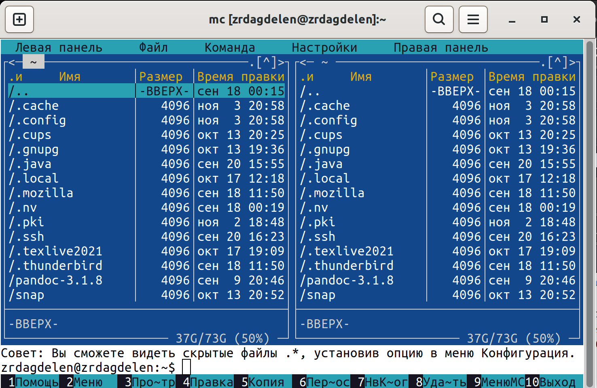

---
## Front matter
title: "Отчёт по Лабораторной работе №5."
subtitle: "Основы работы с Midnight Commander (mc). Структура программы на языке ассемблера NASM. Системные вызовы в ОС GNU Linux"
author: "Дагделен Зейнап Реджеповна"

## Generic otions
lang: ru-RU
toc-title: "Содержание"

## Bibliography
bibliography: bib/cite.bib
csl: pandoc/csl/gost-r-7-0-5-2008-numeric.csl

## Pdf output format
toc: true # Table of contents
toc-depth: 2
lof: true # List of figures
lot: true # List of tables
fontsize: 12pt
linestretch: 1.5
papersize: a4
documentclass: scrreprt
## I18n polyglossia
polyglossia-lang:
  name: russian
  options:
	- spelling=modern
	- babelshorthands=true
polyglossia-otherlangs:
  name: english
## I18n babel
babel-lang: russian
babel-otherlangs: english
## Fonts
mainfont: PT Serif
romanfont: PT Serif
sansfont: PT Sans
monofont: PT Mono
mainfontoptions: Ligatures=TeX
romanfontoptions: Ligatures=TeX
sansfontoptions: Ligatures=TeX,Scale=MatchLowercase
monofontoptions: Scale=MatchLowercase,Scale=0.9
## Biblatex
biblatex: true
biblio-style: "gost-numeric"
biblatexoptions:
  - parentracker=true
  - backend=biber
  - hyperref=auto
  - language=auto
  - autolang=other*
  - citestyle=gost-numeric
## Pandoc-crossref LaTeX customization
figureTitle: "Рис."
tableTitle: "Таблица"
listingTitle: "Листинг"
lofTitle: "Список иллюстраций"
lotTitle: "Список таблиц"
lolTitle: "Листинги"
## Misc options
indent: true
header-includes:
  - \usepackage{indentfirst}
  - \usepackage{float} # keep figures where there are in the text
  - \floatplacement{figure}{H} # keep figures where there are in the text
---

# Цель работы

Приобретение практических навыков работы в Midnight Commander. Освоение инструкций языка ассемблера mov и int.


# Задание

1. Основы работы с mc
2. Структура программы на языке ассемблера NASM
3. Подключение внешнего файла
4. Выполнение заданий для самостоятельной работы

# Теоретическое введение

## Основы работы с Midnight Commander
Midnight Commander — это программа, которая позволяет просматривать структуру каталогов и выполнять основные операции по управлению файловой системой, т.е. mc является файловым менеджером. Midnight Commander позволяет сделать работу с файлами более удобной и наглядной.
Для активации оболочки Midnight Commander достаточно ввести в командной строке mc и нажать клавишу Enter.
В Midnight Commander используются функциональные клавиши F1 — F10 , к которым привязаны часто выполняемые операции.
Некоторые комбинации клавиш облегчают работу с Midnight Commander, например:
- Tab используется для переключениями между панелями;
- ↑ и ↓ используется для навигации, Enter для входа в каталог или открытия файла;
• Ctrl + u меняет местами содержимое
правой и левой панелей; и другие
## Структура программы на языке ассемблера NASM
Программа на языке ассемблера NASM, как правило, состоит из трёх секций: секция кода программы (SECTION .text), секция инициированных (известных во время компиляции) данных (SECTION .data) и секция неинициализированных данных (тех, под которые во время компиляции только отводится память, а значение присваивается в ходе выполнения программы) (SECTION .bss).

Для объявления инициированных данных в секции .data используются директивы:
- DB (define byte) — определяет переменную размером в 1 байт;
- DW (define word) — определяет переменную размеров в 2 байта (слово);
- DD (define double word) — определяет переменную размером в 4 байта (двойное слово);
- DQ (define quad word) — определяет переменную размером в 8 байт (учетверённое слово);
- DT (define ten bytes) — определяет переменную размером в 10 байт.

Директивы используются для объявления простых переменных и для объявления массивов. Для определения строк принято использовать директиву DB в связи с особенностями хранения данных в оперативной памяти.

## Элементы программирования

###  Описание инструкции mov

Инструкция языка ассемблера mov предназначена для дублирования данных источника в приёмнике. В общем виде эта инструкция записывается в виде
	mov dst,src 
Здесь операнд dst — приёмник, а src — источник.
В качестве операнда могут выступать регистры (register), ячейки памяти (memory) и непосредственные значения (const).

###  Описание инструкции int

Инструкция языка ассемблера intпредназначена для вызова прерывания с указанным номером. В общем виде она записывается в виде 
>> int n
Здесь n — номер прерывания, принадлежащий диапазону 0–255.
При программировании в Linux с использованием вызовов ядра sys_calls n=80h (принято задавать в шестнадцатеричной системе счисления).

После вызова инструкции int 80h выполняется системный вызов какой-либо функции ядра Linux. При этом происходит передача управления ядру операционной системы. Чтобы узнать, какую именно системную функцию нужно выполнить, ядро извлекает номер системного вызова из регистра eax. Поэтому перед вызовом прерывания необходимо поместить в этот регистр нужный номер. Кроме того, многим системным функциям требуется передавать какие-либо параметры. По принятым в ОС Linux правилам эти параметры помещаются в порядке следования в остальные регистры процессора: ebx, ecx, edx. Если системная функция должна вернуть значение, то она помещает его в регистр eax.

###  Системные вызовы для обеспечения диалога с пользователем

Простейший диалог с пользователем требует наличия двух функций — вывода текста на экран и ввода текста с клавиатуры. Простейший способ вывести строку на экран — использовать системный вызов write. Этот системный вызов имеет номер 4, поэтому перед вызовом инструкции int необходимо поместить значение 4 в регистр eax. Первым аргументом write, помещаемым в регистр ebx, задаётся дескриптор файла. Для вывода на экран в качестве
дескриптора файла нужно указать 1 (это означает «стандартный вывод», т. е. вывод на экран). \
Вторым аргументом задаётся адрес выводимой строки (помещаем его в регистр ecx, например, инструкцией mov ecx, msg). Строка может иметь любую длину. Последним аргументом (т.е. в регистре edx) должна задаваться максимальная длина выводимой строки.
Для ввода строки с клавиатуры можно использовать аналогичный системный вызов read.
Его аргументы – такие же, как у вызова write, только для «чтения» с клавиатуры используется
файловый дескриптор 0 (стандартный ввод).
Системный вызов exit является обязательным в конце любой программы на языке ассемблер. Для обозначения конца программы перед вызовом инструкции int 80h необходимо поместить в регистр еах значение 1, а в регистр ebx код завершения 0.


# Выполнение лабораторной работы

## Основы работы с mc

1. Открываю Midnight Commander с помощью mc (рис. [-@fig:002]). Но так как эта команда у меня не установлена, следую инструкциям и скачиваю его(рис. [-@fig:001])

{#fig:001 width=80%}

{#fig:002 width=80%}

2. Пользуясь клавишами ↑ , ↓ и Enter, перехожу в каталог ~/work/arch-pc созданный при выполнении лабораторной работы №4 (рис. [-@fig:003]).

{#fig:003 width=80%}

3. С помощью функциональной клавиши F7 создаю папку lab05 (рис. [-@fig:004]) и перехожу в созданный каталог.

{#fig:004 width=80%}


4. Пользуясь строкой ввода и командой touch создаю файл lab5-1.asm (рис. [-@fig:005]). Проверяем (рис. [-@fig:006])

{#fig:005 width=80%}

{#fig:006 width=80%}

## Структура программы на языке ассемблера NASM

5. С помощью функциональной клавиши F4 открываю файл lab5-1.asm для редактирования во встроенном редакторе. В качестве встроенного редактора Midnight Commander использую редактор nano (рис. [-@fig:007]) 

{#fig:007 width=80%}

6. Ввожу текст программы из листинга 5.1, данного в PDF-файле по лабораторной №5 в курсе Архитектура ЭВМ, сохраняю изменения и закрываю файл (для редактора nano: Ctrl + x (выход) > Y (сохранить изменения) > Enter) (рис. [-@fig:008]).

{#fig:008 width=80%}

7. Оттранслирую текст программы lab5-1.asm в объектный файл с помощью команды nasm -f (так как у меня 64-битная версия, использую elf64) (рис.[-@fig:009]). Выполняю компоновку объектного файла с помощью ld -m (так как у меня архитектура Линукса x86, использую elf_x86_64) (рис. [-@fig:010])и запускаю получившийся исполняемый файл . Программа выводит строку 'Введите строку:' и ожидает ввода с клавиатуры. На этот запрос ввожу свое ФИО: Дагделен Зейнап Реджеповна (рис.[-@fig:011]). \

{#fig:009 width=80%}

{#fig:010 width=80%}

{#fig:011 width=80%}

## Подключение внешнего файла

8. Скачиваю файл in_out.asm со страницы курса в ТУИС. Теперб этот файл в папке "Загрузки" (рис.[-@fig:012]).

{#fig:012 width=80%}

9. Копирую с помощью функциональной клавиши F5 подключаемый файл in_out.asm в тот же каталог, что и файл с программой, в которой он используется (рис. [-@fig:013]).

{#fig:013 width=80%}

10. С помощью функциональной клавиши F6 создаю копию файла lab5-1.asm с именем lab5-2.asm. Выделяю файл lab5-1.asm, нажимаю клавишу F6, ввожу имя файла lab5-2.asm и нажмимаю клавишу Enter (рис. [-@fig:014]).

{#fig:014 width=80%} 

11. Исправляю текст программы в файле lab5-2.asm с использованием подпрограмм из внешнего файла in_out.asm (использую подпрограммы sprintLF, sread и quit) в соответствии с листингом 5.2. (рис. [-@fig:015]). Создаю исполняемый файл (рис.[-@fig:016] - рис.[-@fig:017]) и проверяю его работу (рис. [-@fig:018]).

{#fig:016 width=80%}

{#fig:017 width=80%}

{#fig:018 width=80%}

12. В файле lab5-2.asm заменяю подпрограмму sprintLF на sprint. Создаю исполняемый файл (рис.[-@fig:019] - рис.[-@fig:020]) и проверяю его работу (рис. [-@fig:021]). В чем разница? Разница в том, что в первом случае (с подпрограммой sprintLF): строка вводится на следующей строке (то есть программа принимает мое ФИО с новой строки); во втором случае: все вводится и выводится на одной строке.

{#fig:019 width=80%}

{#fig:020 width=80%}

{#fig:021 width=80%}

## Задание для самостоятельной работы
1. Создаю копию файла lab5-1.asm, для удобства переименовываю (рис.[-@fig:022]). Вношу изменения в программу (без использования внешнего файла in_out.asm), так чтобы она работала по следующему алгоритму (рис.[-@fig:023]):
- выводит приглашение типа “Введите строку:”;
- вводит строку с клавиатуры;
- выводит введённую строку на экран.

{#fig:022 width=80%}

{#fig:023 width=80%}

Текст программы:

```NASM
SECTION .data ; Секция инициированных данных
msg: DB 'Введите строку:',10
msgLen: EQU $-msg ; Длина переменной 'msg'
SECTION .bss ; Секция не инициированных данных
buf1: RESB 80 ; Буфер размером 80 байт
SECTION .text ; Код программы
GLOBAL _start ; Начало программы
_start: ; Точка входа в программу
mov eax,4 ; Системный вызов для записи (sys_write)
mov ebx,1 ; Описатель файла 1 - стандартный вывод
mov ecx,msg ; Адрес строки 'msg' в 'ecx'
mov edx,msgLen ; Размер строки 'msg' в 'edx'
int 80h ; Вызов ядра
mov eax, 3 ; Системный вызов для чтения (sys_read)
mov ebx, 0 ; Дескриптор файла 0 - стандартный ввод
mov ecx, buf1 ; Адрес буфера под вводимую строку
mov edx, 80 ; Длина вводимой строки
int 80h ; Вызов ядра
mov eax,4 ; Системный вызов для записи (sys_write)
mov ebx,1 ; Описатель файла '1' - стандартный вывод
mov ecx,buf1 ; Адрес строки buf1 в ecx
mov edx,buf1 ; Размер строки buf1
int 80h ; Вызов ядра
mov eax,1 ; Системный вызов для выхода (sys_exit)
mov ebx,0 ; Выход с кодом возврата 0 (без ошибок)
int 80h ; Вызов ядра
```

2. Получаю исполняемый файл (рис.[-@fig:024]-рис.[-@fig:025]) и проверяю его работу (рис.[-@fig:026]).

{#fig:024 width=80%}

{#fig:025 width=80%}

{#fig:026 width=80%}

3. Создаю копию файла lab5-2.asm с именем lab5-2-1 (рис. [-@fig:027]). Исправляю текст программы с использованием подпрограмм из внешнего файла in_out.asm, так чтобы она работала такому же алгоритму, как и программа lab5-1-1 (рис.[-@fig:028]).

{#fig:027 width=80%}

{#fig:028 width=80%}

Текст программы:

```NASM
%include 'in_out.asm'
SECTION .data ; Секция инициированных данных
msg: DB 'Введите строку: ',0h ; сообщение
SECTION .bss ; Секция не инициированных данных
buf1: RESB 80 ; Буфер размером 80 байт
SECTION .text ; Код программы
GLOBAL _start ; Начало программы
_start: ; Точка входа в программу
mov eax, msg ; запись адреса выводимого сообщения в `EAX`
call sprint ; вызов подпрограммы печати сообщения
mov ecx, buf1 ; запись адреса переменной в `EAX`
mov edx, 80 ; запись длины вводимого сообщения в `EBX`
call sread ; вызов подпрограммы ввода сообщения
mov eax,4 ; Системный вызов для записи (sys_write)
mov ebx,1 ; Описатель файла '1' - стандартный вывод
mov ecx,buf1 ; Адрес строки buf1 в ecx
int 80h ; Вызов ядра
call quit ; вызов подпрограммы завершения
```

4. Создаю исполняемый файл (рис.[-@fig:029]-рис.[-@fig:030]) и проверяю его работу(рис.[-@fig:031]).

{#fig:029 width=80%}

{#fig:030 width=80%}

{#fig:031 width=80%}

# Выводы

Я приобрела практические навыки работы в Midnight Commander и освоила инструкции языка ассемблера mov и int.

# Список литературы
[Архитектура ЭВМ](https://esystem.rudn.ru/pluginfile.php/2089085/mod_resource/content/0/%D0%9B%D0%B0%D0%B1%D0%BE%D1%80%D0%B0%D1%82%D0%BE%D1%80%D0%BD%D0%B0%D1%8F%20%D1%80%D0%B0%D0%B1%D0%BE%D1%82%D0%B0%20%E2%84%965.%20%D0%9E%D1%81%D0%BD%D0%BE%D0%B2%D1%8B%20%D1%80%D0%B0%D0%B1%D0%BE%D1%82%D1%8B%20%D1%81%20Midnight%20Commander%20%28%29.%20%D0%A1%D1%82%D1%80%D1%83%D0%BA%D1%82%D1%83%D1%80%D0%B0%20%D0%BF%D1%80%D0%BE%D0%B3%D1%80%D0%B0%D0%BC%D0%BC%D1%8B%20%D0%BD%D0%B0%20%D1%8F%D0%B7%D1%8B%D0%BA%D0%B5%20%D0%B0%D1%81%D1%81%D0%B5%D0%BC%D0%B1%D0%BB%D0%B5%D1%80%D0%B0%20NASM.%20%D0%A1%D0%B8%D1%81%D1%82%D0%B5%D0%BC%D0%BD%D1%8B%D0%B5%20%D0%B2%D1%8B%D0%B7%D0%BE%D0%B2%D1%8B%20%D0%B2%20%D0%9E%D0%A1%20GNU%20Linux.pdf)

