---
## Front matter
title: "Лабораторная работа №6"
subtitle: "Арифметические операции в NASM."
author: "Дагделен Зейнап Реджеповна"

## Generic otions
lang: ru-RU
toc-title: "Содержание"

## Bibliography
bibliography: bib/cite.bib
csl: pandoc/csl/gost-r-7-0-5-2008-numeric.csl

## Pdf output format
toc: true # Table of contents
toc-depth: 2
lof: true # List of figures
lot: true # List of tables
fontsize: 12pt
linestretch: 1.5
papersize: a4
documentclass: scrreprt
## I18n polyglossia
polyglossia-lang:
  name: russian
  options:
	- spelling=modern
	- babelshorthands=true
polyglossia-otherlangs:
  name: english
## I18n babel
babel-lang: russian
babel-otherlangs: english
## Fonts
mainfont: PT Serif
romanfont: PT Serif
sansfont: PT Sans
monofont: PT Mono
mainfontoptions: Ligatures=TeX
romanfontoptions: Ligatures=TeX
sansfontoptions: Ligatures=TeX,Scale=MatchLowercase
monofontoptions: Scale=MatchLowercase,Scale=0.9
## Biblatex
biblatex: true
biblio-style: "gost-numeric"
biblatexoptions:
  - parentracker=true
  - backend=biber
  - hyperref=auto
  - language=auto
  - autolang=other*
  - citestyle=gost-numeric
## Pandoc-crossref LaTeX customization
figureTitle: "Рис."
tableTitle: "Таблица"
listingTitle: "Листинг"
lofTitle: "Список иллюстраций"
lotTitle: "Список таблиц"
lolTitle: "Листинги"
## Misc options
indent: true
header-includes:
  - \usepackage{indentfirst}
  - \usepackage{float} # keep figures where there are in the text
  - \floatplacement{figure}{H} # keep figures where there are in the text
---

# Цель работы

Освоение арифметических инструкций языка ассемблера NASM.

# Задание

1. Символьные и численные данные в NASM
2. Выполнение арифметических операций в NASM
3. Выполнение заданий для самостоятельной работы


# Теоретическое введение

## Адресация в NASM

Большинство инструкций на языке ассемблера требуют обработки операндов. Адрес операнда предоставляет место, где хранятся данные, подлежащие обработке. Это могут быть данные хранящиеся в регистре или в ячейке памяти. Далее рассмотрены все существующие способы задания адреса хранения операндов – способы адресации. \
Существует три основных способа адресации:
- *Регистровая адресация* – операнды хранятся в регистрах и в команде используются
имена этих регистров, например: mov ax,bx.
- *Непосредственная адресация* – значение операнда задается непосредственно в ко-
манде, Например: mov ax,2.
- *Адресация памяти* – операнд задает адрес в памяти. В команде указывается символи-
ческое обозначение ячейки памяти, над содержимым которой требуется выполнить
операцию.

## Арифметические операции в NASM

###  Целочисленное сложение add.

Схема команды целочисленного сложения add (от англ. addition - добавление) выполняет сложение двух операндов и записывает результат по адресу первого операнда. Команда add работает как с числами со знаком, так и без знака и выглядит следующим образом: \
add <операнд_1>, <операнд_2> \
Допустимые сочетания операндов для команды add аналогичны сочетаниям операндов для команды mov.

### Целочисленное вычитание sub.

Команда целочисленного вычитания sub (от англ. subtraction – вычитание) работает аналогично команде add и выглядит следующим образом: \
sub <операнд_1>, <операнд_2> \

### Команды инкремента и декремента.

Довольно часто при написании программ встречается операция прибавления или вычитания единицы. Прибавление единицы называется инкрементом, а вычитание — декрементом. Для этих операций существуют специальные команды: inc (от англ. increment) и dec (от англ. decrement), которые увеличивают и уменьшают на 1 свой операнд. \
Эти команды содержат один операнд и имеет следующий вид: \
inc <операнд> \
dec <операнд> \
Операндом может быть регистр или ячейка памяти любого размера. Команды инкремента и декремента выгодны тем, что они занимают меньше места, чем соответствующие команды сложения и вычитания.

### Команда изменения знака операнда neg.

Еще одна команда, которую можно отнести к арифметическим командам это команда изменения знака neg: \
neg <операнд> \
Команда neg рассматривает свой операнд как число со знаком и меняет знак операнда на противоположный. Операндом может быть регистр или ячейка памяти любого размера.\
Умножение и деление, в отличии от сложения и вычитания, для знаковых и беззнаковых чисел производиться по-разному, поэтому существуют различные команды. \
Для беззнакового умножения используется команда mul (от англ. multiply – умножение): \
mul <операнд> \
Для знакового умножения используется команда imul: \
imul <операнд> \
Для команд умножения один из сомножителей указывается в команде и должен находиться в регистре или в памяти, но не может быть непосредственным операндом. Второй сомножитель в команде явно не указывается и должен находиться в регистре EAX,AX или AL, а результат помещается в регистры EDX:EAX, DX:AX или AX, в зависимости от размера операнда.

### Команды деления div и idiv.

Для деления, как и для умножения, существует 2 команды div (от англ. divide - деление) и idiv: \
div <делитель> ; Беззнаковое деление \
idiv <делитель> ; Знаковое деление \
В командах указывается только один операнд – делитель, который может быть регистром или ячейкой памяти, но не может быть непосредственным операндом. Местоположение делимого и результата для команд деления зависит от размера делителя. Кроме того, так как в результате деления получается два числа – частное и остаток, то эти числа помещаются в определённые регистры.

## Перевод символа числа в десятичную символьную запись

Ввод информации с клавиатуры и вывод её на экран осуществляется в символьном виде. Кодирование этой информации производится согласно кодовой таблице символов ASCII. Согласно стандарту ASCII каждый символ кодируется одним байтом.

Среди инструкций NASM нет такой, которая выводит числа (не в символьном виде). Для решения этой проблемы необходимо проводить преобразование ASCII символов в числа и обратно.


# Выполнение лабораторной работы

## Символьные и численные данные в NASM

1. Создаю каталог для программам лабораторной работы № 6 с помощью команды mkdir, и, перейдя в него, создаю файл lab6-1.asm с помощью touch (рис. [-@fig:001]).

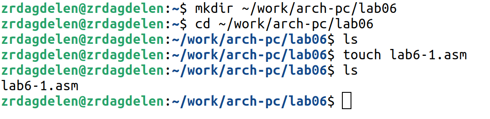{#fig:001 width=80%}

2. Рассмотрю примеры программ вывода символьных и численных значений. Программы будут выводить значения записанные в регистр eax. \
Ввожу в файл lab6-1.asm текст программы из листинга 6.1 (рис. [-@fig:002]).

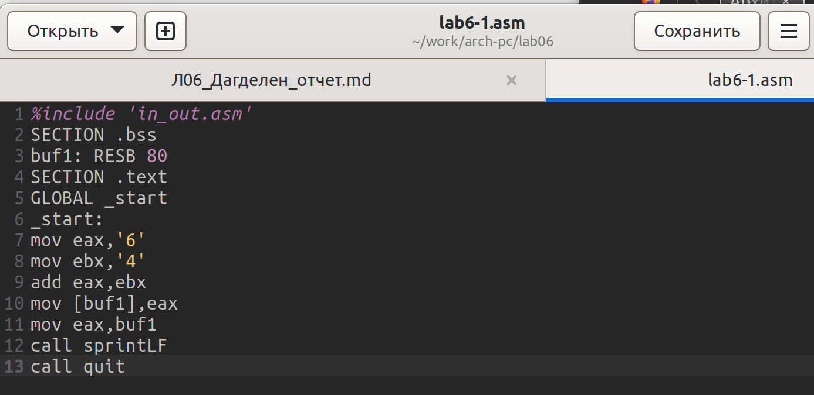{#fig:002 width=80%}


Создаю исполняемый файл и запускаю его(рис. [-@fig:003]).

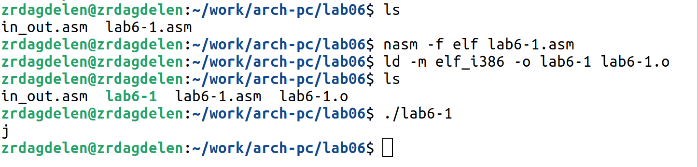{#fig:003 width=80%}

**Вывод программы:** символ j, потому что программа вывела символ, соответствующий по системе ASCII сумме двоичных кодов символов 4 и 6.

3. Далее измяю текст программы и вместо символов, записываю в регистры числа. Ис- правляю текст программы (Листинг 6.1) следующим образом (рис. [-@fig:004]).

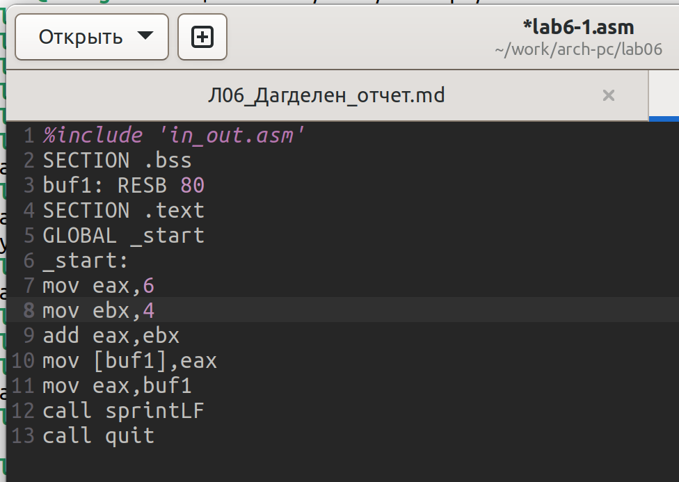{#fig:004 width=80%}

Создаю исполняемый файл и запускаю его(рис. [-@fig:005]).

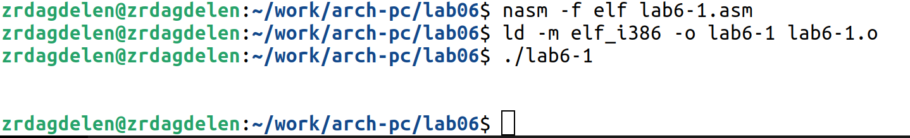{#fig:005 width=80%}

Как и в предыдущем случае при исполнении программы я не получила число 10. В данном случае выводится символ с кодом 10. Это символ перевода строки, к сожалению, он не отображается при выводе на экран.

4. Создаю файл lab6-2.asm в каталоге ~/work/arch-pc/lab06 с помощью touch и ввожу в него текст программы из листинга 6.2(рис. [-@fig:006]- [-@fig:007]). Создаю исполняемый файл и запускаю его (рис. [-@fig:008]).

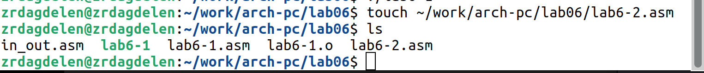{#fig:006 width=80%}


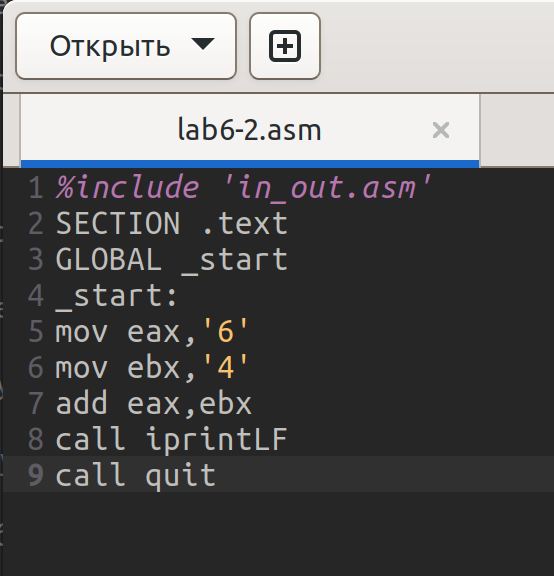{#fig:007 width=80%}

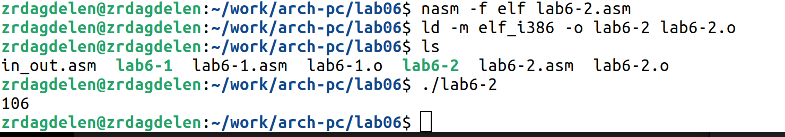{#fig:008 width=80%}

В результате работы программы я получила число 106. В данном случае, как и в первом,
команда add складывает коды символов ‘6’ и ‘4’ (54+52=106). Однако, в отличии от программы из листинга 6.1, функция iprintLF позволяет вывести число, а не символ, кодом которого является это число.

5. Аналогично предыдущему примеру изменю символы на числа. Заменяю строки (рис. [-@fig:009]).

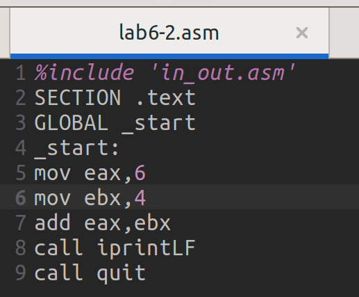{#fig:009 width=80%}

Создаю исполняемый файл и запускаю его(рис. [-@fig:010]).

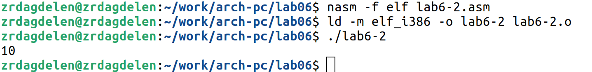{#fig:010 width=80%}

Теперь программа складывает не  коды, соответствующие символам в системе ASCII, а сами числа, поэтому вывод 10.
Заменяю функцию iprintLF на iprint(рис. [-@fig:011]).

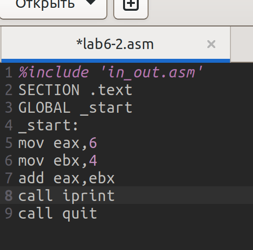{#fig:011 width=80%}

 Создаю исполняемый файл и запускаю его(рис. [-@fig:012]).

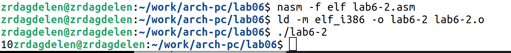{#fig:012 width=80%}

Чем отличается вывод функций iprintLF и iprint? Вывод не изменился, потому что символ переноса строки не отображался, когда программа исполнялась с функцией iprintLF, а iprint не добавляет к выводу символ переноса строки, в отличие от iprintLF.

## Выполнение арифметических операций в NASM

6. В качестве примера выполнения арифметических операций в NASM приведем про-
грамму вычисления арифметического выражения f(x) = (5 ∗ 2 + 3)/3.
Создаю файл lab6-3.asm в каталоге ~/work/arch-pc/lab06 с помощью touch (рис. [-@fig:013]).

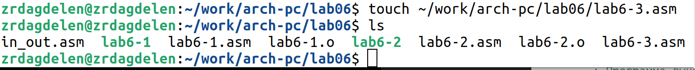{#fig:013 width=80%}

Ввожу текст программы из листинга 6.3 в lab6-3.asm(рис. [-@fig:014]).

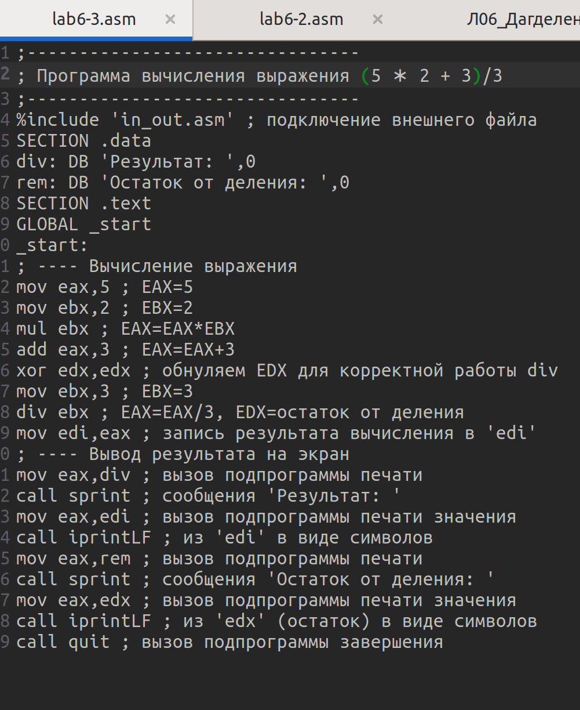{#fig:014 width=80%}

Создаю исполняемый файл и запускаю его(рис. [-@fig:015]).

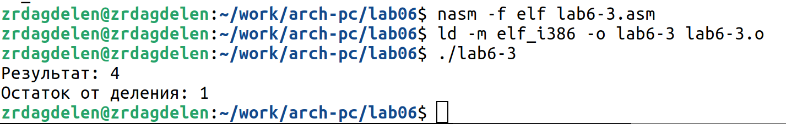{#fig:015 width=80%} 

Результат работы программы следующий: результат = 4, остаток = 1.

Изменяю текст программы для вычисления выражения f(x) = (4 ∗ 6 + 2)/5(рис. [-@fig:016]).

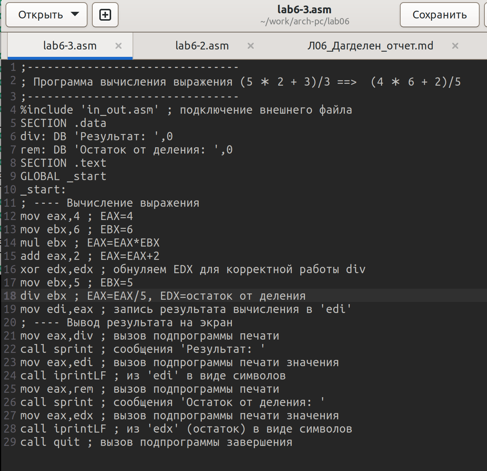{#fig:016 width=80%}

 Создаю исполняемый файл и проверяю его работу(рис. [-@fig:017]).

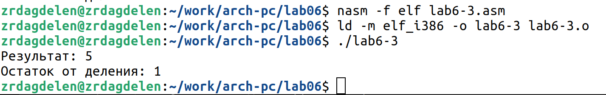{#fig:017 width=80%}

7. В качестве другого примера рассмотрю программу вычисления варианта задания по
номеру студенческого билета, работающую по следующему алгоритму:
- вывести запрос на введение № студенческого билета
- вычислить номер варианта по формуле: (𝑆𝑛 mod 20) + 1, где 𝑆𝑛 – номер студен-
ческого билета (В данном случае 𝑎 mod 𝑏 – это остаток от деления 𝑎 на 𝑏).
- вывести на экран номер варианта.

Создаю файл variant.asm в каталоге ~/work/arch-pc/lab06 с помощью touch, заполняю его в соответсвии с листингом 6.4(рис. [-@fig:018]), создаю исполняемый файл и запускаю его(рис. [-@fig:019]).

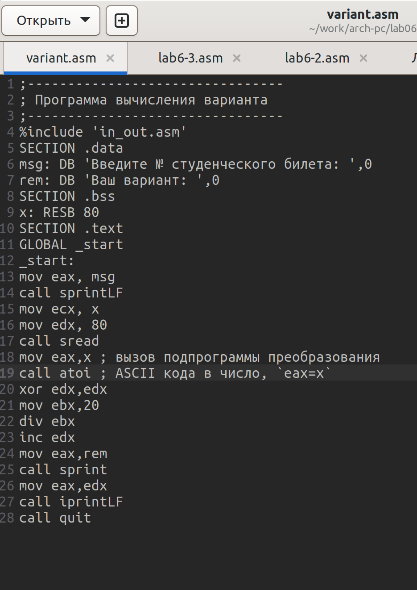{#fig:018 width=80%}

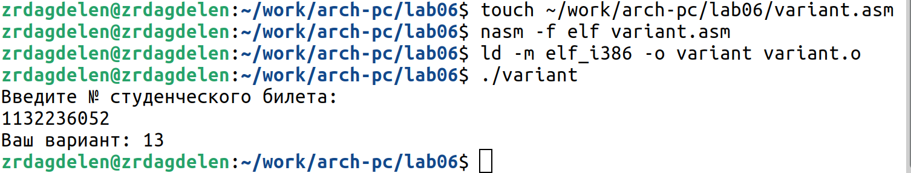{#fig:019 width=80%}

Я посчитала для проверки правильности работы программы значение выражения самостоятельно, программа отработала верно.

## Ответы на вопросы:

1. Какие строки листинга 6.4 отвечают за вывод на экран сообщения ‘Ваш вариант:’? Ответ:

```NASM
mov eax,rem
call sprint
```

2. Для чего используется следующие инструкции?
mov ecx, x
mov edx, 80
call sread \
Ответ: Инструкция mov ecx, x -- чтобы положить адрес вводимой строки x в регистр ecx;
mov edx, 80 - запись в регистр edx длины вводимой строки; call sread - вызов подпрограммы из внешнего файла, обеспечивающей ввод сообщения с клавиатуры 

3. Для чего используется инструкция “call atoi”? Ответ: для вызова подпрограммы из внешнего файла, которая преобразует ascii-код символа в целое число и записывает результат в регистр eax
4. Какие строки листинга 6.4 отвечают за вычисления варианта? Ответ:

```NASM
xor edx,edx ; обнуление edx для корректной работы div
mov ebx,20 ; ebx = 20
div ebx ; eax = eax/20, edx - остаток от деления
inc edx ; edx = edx + 1
```

5. В какой регистр записывается остаток от деления при выполнении инструкции “div
ebx”? Ответ: в регистр edx
6. Для чего используется инструкция “inc edx”? Ответ: для увеличения значения регистра edx на 1
7. Какие строки листинга 6.4 отвечают за вывод на экран результата вычислений? Ответ:

```NASM
mov eax,edx
call iprintLF
```


## Задание для самостоятельной работы

**Напишу программу вычисления выражения y=f(x).** \
Создаю файл variant-13.asm. Открываю созданный файл для редактирования, ввожу в него текст программы для вычисления значения выражения (8x + 6) * 10 (рис. [-@fig:020]). Это выражение было под вариантом 13.

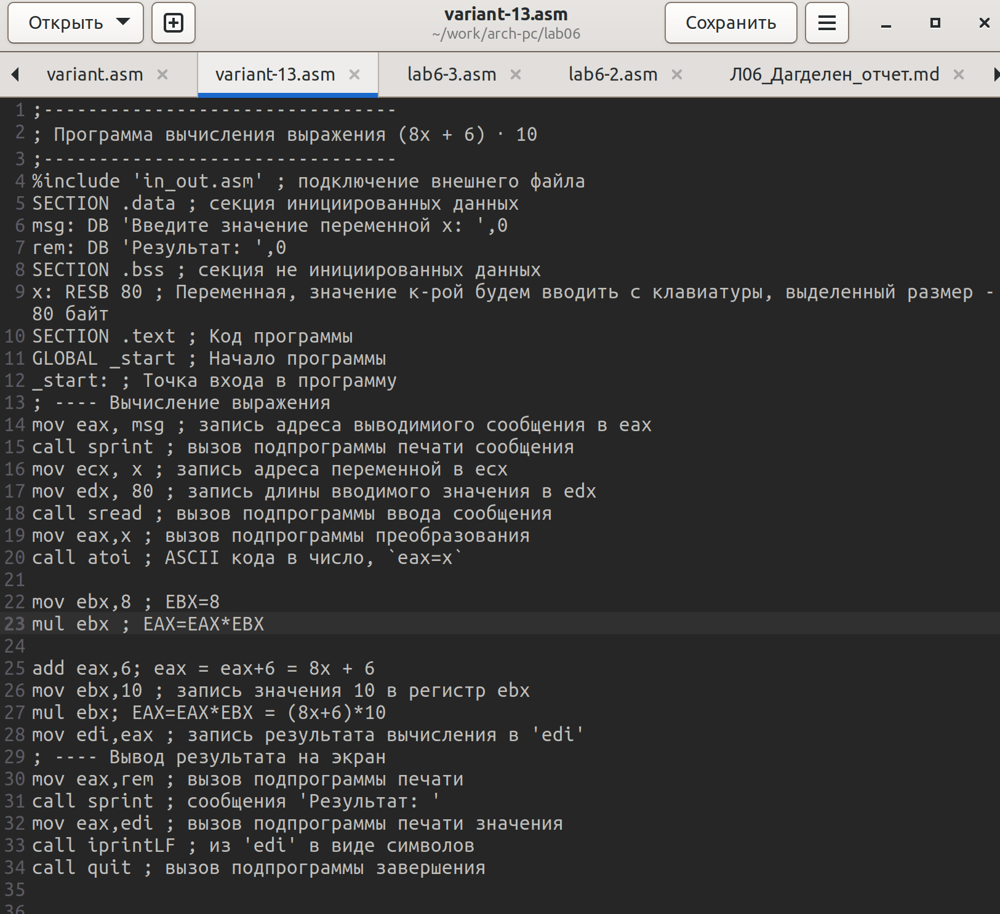{#fig:020 width=80%}


Создаю и запускаю исполняемый файл (рис. [-@fig:021]).

{#fig:021 width=80%}

При вводе значения 1, вывод - 140. При вводе значения 4, вывод - 380 \
Программа отработала верно.

**Программа для вычисления значения выражения (8x + 6) * 10.**

```NASM
;--------------------------------
; Программа вычисления выражения (8x + 6)*10
;--------------------------------
%include 'in_out.asm' ; подключение внешнего файла
SECTION .data ; секция инициированных данных
msg: DB 'Введите значение переменной х: ',0
rem: DB 'Результат: ',0
SECTION .bss ; секция не инициированных данных
x: RESB 80 ; Переменная, значение к-рой будем вводить с клавиатуры, выделенный размер - 80 байт
SECTION .text ; Код программы
GLOBAL _start ; Начало программы
_start: ; Точка входа в программу
; ---- Вычисление выражения
mov eax, msg ; запись адреса выводимиого сообщения в eax
call sprint ; вызов подпрограммы печати сообщения
mov ecx, x ; запись адреса переменной в ecx
mov edx, 80 ; запись длины вводимого значения в edx
call sread ; вызов подпрограммы ввода сообщения
mov eax,x ; вызов подпрограммы преобразования
call atoi ; ASCII кода в число, `eax=x`

mov ebx,8 ; EBX=8
mul ebx ; EAX=EAX*EBX

add eax,6; eax = eax+6 = 8x + 6
mov ebx,10 ; запись значения 10 в регистр ebx
mul ebx; EAX=EAX*EBX = (8x+6)*10
mov edi,eax ; запись результата вычисления в 'edi'
; ---- Вывод результата на экран
mov eax,rem ; вызов подпрограммы печати
call sprint ; сообщения 'Результат: '
mov eax,edi ; вызов подпрограммы печати значения
call iprintLF ; из 'edi' в виде символов
call quit ; вызов подпрограммы завершения
```


# Выводы

При выполнении данной лабораторной работы я освоила арифметические инструкции языка ассемблера NASM.


# Список литературы
[Архитектура ЭВМ](https://esystem.rudn.ru/pluginfile.php/2089086/mod_resource/content/0/%D0%9B%D0%B0%D0%B1%D0%BE%D1%80%D0%B0%D1%82%D0%BE%D1%80%D0%BD%D0%B0%D1%8F%20%D1%80%D0%B0%D0%B1%D0%BE%D1%82%D0%B0%20%E2%84%966.%20%D0%90%D1%80%D0%B8%D1%84%D0%BC%D0%B5%D1%82%D0%B8%D1%87%D0%B5%D1%81%D0%BA%D0%B8%D0%B5%20%D0%BE%D0%BF%D0%B5%D1%80%D0%B0%D1%86%D0%B8%D0%B8%20%D0%B2%20NASM..pdf)
