---
## Front matter
title: "Лабораторная работа №7."
subtitle: "Команды безусловного и
условного переходов в Nasm. Программирование
ветвлений."
author: "Зейнап Дагделен Реджеповна"

## Generic otions
lang: ru-RU
toc-title: "Содержание"

## Bibliography
bibliography: bib/cite.bib
csl: pandoc/csl/gost-r-7-0-5-2008-numeric.csl

## Pdf output format
toc: true # Table of contents
toc-depth: 2
lof: true # List of figures
lot: true # List of tables
fontsize: 12pt
linestretch: 1.5
papersize: a4
documentclass: scrreprt
## I18n polyglossia
polyglossia-lang:
  name: russian
  options:
	- spelling=modern
	- babelshorthands=true
polyglossia-otherlangs:
  name: english
## I18n babel
babel-lang: russian
babel-otherlangs: english
## Fonts
mainfont: PT Serif
romanfont: PT Serif
sansfont: PT Sans
monofont: PT Mono
mainfontoptions: Ligatures=TeX
romanfontoptions: Ligatures=TeX
sansfontoptions: Ligatures=TeX,Scale=MatchLowercase
monofontoptions: Scale=MatchLowercase,Scale=0.9
## Biblatex
biblatex: true
biblio-style: "gost-numeric"
biblatexoptions:
  - parentracker=true
  - backend=biber
  - hyperref=auto
  - language=auto
  - autolang=other*
  - citestyle=gost-numeric
## Pandoc-crossref LaTeX customization
figureTitle: "Рис."
tableTitle: "Таблица"
listingTitle: "Листинг"
lofTitle: "Список иллюстраций"
lotTitle: "Список таблиц"
lolTitle: "Листинги"
## Misc options
indent: true
header-includes:
  - \usepackage{indentfirst}
  - \usepackage{float} # keep figures where there are in the text
  - \floatplacement{figure}{H} # keep figures where there are in the text
---

# Цель работы

Изучение команд условного и безусловного переходов. Приобретение навыков написания
программ с использованием переходов. Знакомство с назначением и структурой файла
листинга.

# Задание

1. Реализация переходов в NASM.
2. Изучение структуры файлы листинга.
3. Задания для самостоятельной работы.


# Теоретическое введение

Для реализации ветвлений в ассемблере используются так называемые команды передачи
управления или команды перехода. Можно выделить 2 типа переходов:
- условный переход – выполнение или не выполнение перехода в определенную точку
программы в зависимости от проверки условия.
- безусловный переход – выполнение передачи управления в определенную точку про-
граммы без каких-либо условий.

## Команды безусловного перехода

Безусловный переход выполняется инструкцией jmp, которая
включает в себя адрес перехода, куда следует передать управление: \
jmp <адрес_перехода> \
Адрес перехода может быть либо меткой, либо адресом области памяти, в которую предва-
рительно помещен указатель перехода. Кроме того, в качестве операнда можно использовать
имя регистра, в таком случае переход будет осуществляться по адресу, хранящемуся в этом
регистре 

## Команды условного перехода

Как отмечалось выше, для условного перехода необходима проверка какого-либо условия.
В ассемблере команды условного перехода вычисляют условие перехода анализируя флаги
из регистра флагов.

### Регистр флагов

Флаг – это бит, принимающий значение 1 («флаг установлен»), если выполнено некоторое
условие, и значение 0 («флаг сброшен») в противном случае. Флаги работают независимо
друг от друга, и лишь для удобства они помещены в единый регистр — регистр флагов, отра-
жающий текущее состояние процессора. В следующей таблице указано положение битовых
флагов в регистре флагов.

Флаги состояния (биты 0, 2, 4, 6, 7 и 11) отражают результат выполнения арифметических
инструкций, таких как ADD, SUB, MUL, DIV.

### Описание инструкции cmp

Инструкция cmp является одной из инструкций, которая позволяет сравнить операнды и
выставляет флаги в зависимости от результата сравнения.
Инструкция cmp является командой сравнения двух операндов и имеет такой же формат,
как и команда вычитания: \
cmp <операнд_1>, <операнд_2> \
Команда cmp, так же как и команда вычитания, выполняет вычитание <операнд_2> -
<операнд_1>, но результат вычитания никуда не записывается и единственным результатом
команды сравнения является формирование флагов.

### Описание команд условного перехода.

Команда условного перехода имеет вид \
j<мнемоника перехода> label\
Мнемоника перехода связана со значением анализируемых флагов или со способом фор-
мирования этих флагов. 
В мнемокодах указывается тот результат сравнения, при котором
надо делать переход. Мнемоники, идентичные по своему действию. Программист выбирает, какую из них применить, чтобы
получить более простой для понимания текст программы.

### Файл листинга и его структура
Листинг (в рамках понятийного аппарата NASM) — это один из выходных файлов, созда-
ваемых транслятором. Он имеет текстовый вид и нужен при отладке программы, так как
кроме строк самой программы он содержит дополнительную информацию.
Все ошибки и предупреждения, обнаруженные при ассемблировании, транслятор выводит
на экран, и файл листинга не создаётся.
Итак, структура листинга:
- номер строки — это номер строки файла листинга (нужно помнить, что номер строки в
файле листинга может не соответствовать номеру строки в файле с исходным текстом
программы);
- адрес — это смещение машинного кода от начала текущего сегмента;
- машинный код представляет собой ассемблированную исходную строку в виде шестна-
дцатеричной последовательности. (например, инструкция int 80h начинается по сме-
щению 00000020 в сегменте кода; далее идёт машинный код, в который ассемблируется
инструкция, то есть инструкция int 80h ассемблируется в CD80 (в шестнадцатеричном
представлении); CD80 — это инструкция на машинном языке, вызывающая прерывание
ядра);
- исходный текст программы — это просто строка исходной программы вместе с ком-
ментариями (некоторые строки на языке ассемблера, например, строки, содержащие
только комментарии, не генерируют никакого машинного кода, и поля «смещение» и
«исходный текст программы» в таких строках отсутствуют, однако номер строки им
присваивается).


# Выполнение лабораторной работы

## Реализация переходов в NASM

1. Создаю каталог для программам лабораторной работы № 7 (используя команду mkdir), перехожу в него (с помощью cd) и создаю файл lab7-1.asm благодаря touch (рис. [-@fig:001]).

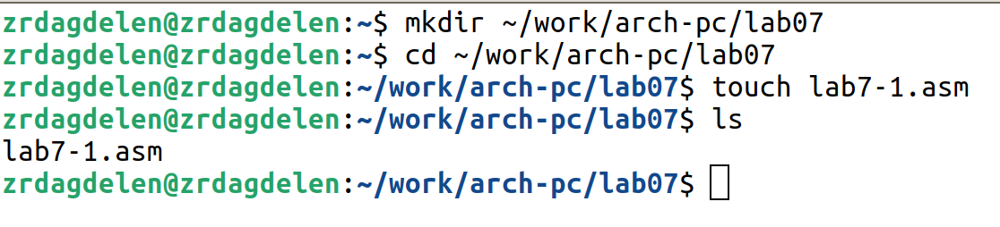{#fig:001 width=80%}

2. Инструкция jmp в NASM используется для реализации безусловных переходов. Ввожу в файл lab7-1.asm текст программы из листинга 7.1 (рис. [-@fig:002]).

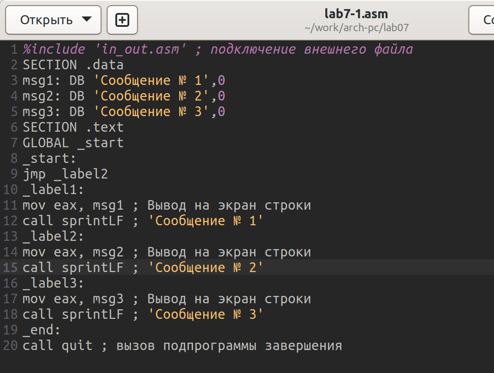{#fig:002 width=80%}


Создаю исполняемый файл и запускаю его. Результат работы данной программы будет
следующий (рис. [-@fig:003]).

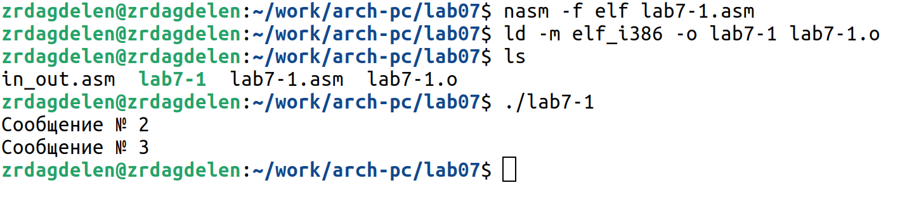{#fig:003 width=80%}

Таким образом, использование инструкции jmp _label2 меняет порядок исполнения
инструкций и позволяет выполнить инструкции начиная с метки _label2, пропустив вывод
первого сообщения.
Инструкция jmp позволяет осуществлять переходы не только вперед, но и назад. Изменю
программу таким образом, чтобы она выводила сначала ‘Сообщение № 2’, потом ‘Сообщение
№ 1’ и завершала работу. Изменяю текст программы в соответствии с листингом 7.2 (рис. [-@fig:004]).

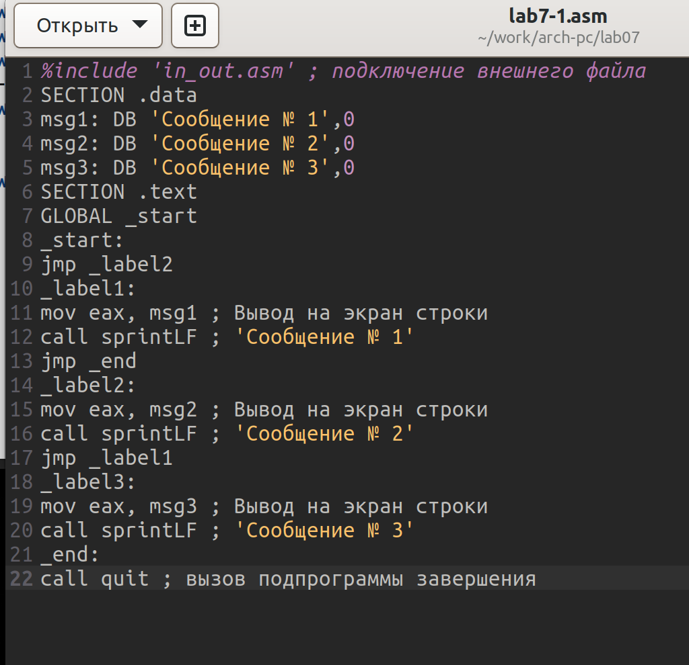{#fig:004 width=80%}


Создаю исполняемый файл и проверяю его работу(рис. [-@fig:005]). Все работает правильно.

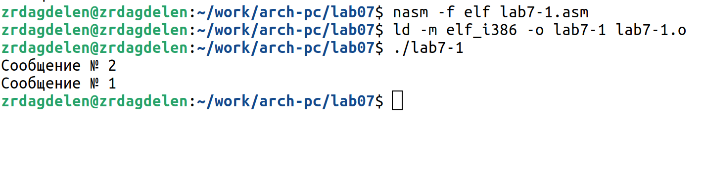{#fig:005 width=80%}

Изменияю текст программы так, чтобы вывод программы был следующим: \
Сообщение № 3 \
Сообщение № 2 \
Сообщение № 1 \
Для этого добавляю в текст программы команды jmp _label3 и jmp _label2 следующим образом (рис. [-@fig:006]).

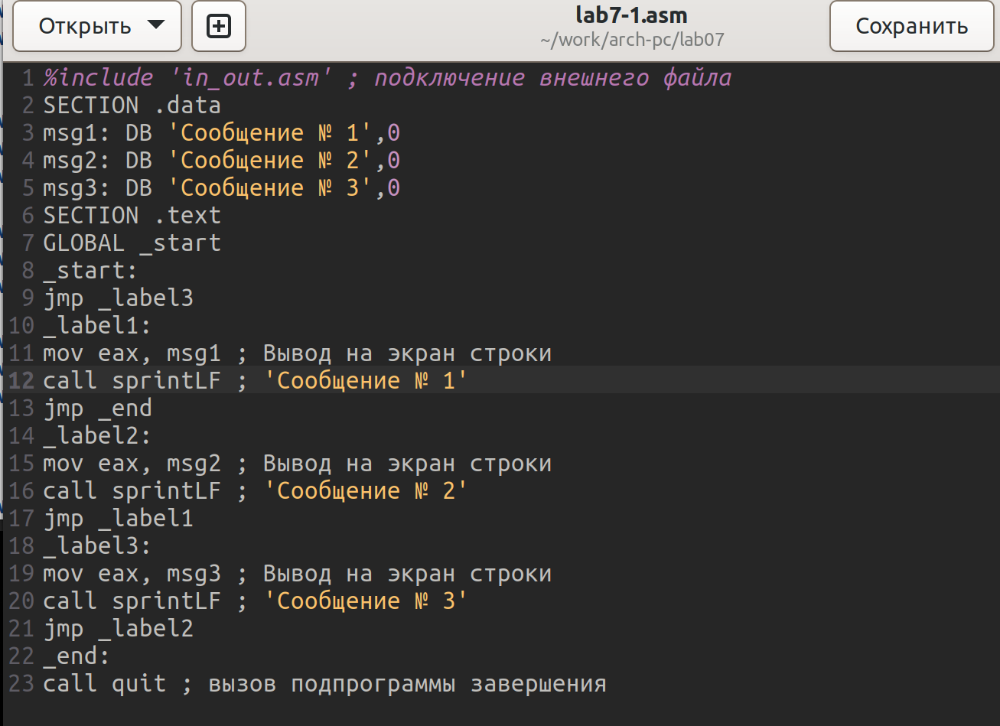{#fig:006 width=80%}

Создаю исполняемый файл и проверяю его работу(рис. [-@fig:007]). Все работает правильно.

{#fig:007 width=80%}

Текст программы:
```NASM
%include 'in_out.asm' ; подключение внешнего файла
SECTION .data
msg1: DB 'Сообщение № 1',0
msg2: DB 'Сообщение № 2',0
msg3: DB 'Сообщение № 3',0
SECTION .text
GLOBAL _start
_start:
jmp _label3
_label1:
mov eax, msg1 ; Вывод на экран строки
call sprintLF ; 'Сообщение № 1'
jmp _end
_label2:
mov eax, msg2 ; Вывод на экран строки
call sprintLF ; 'Сообщение № 2'
jmp _label1
_label3:
mov eax, msg3 ; Вывод на экран строки
call sprintLF ; 'Сообщение № 3'
jmp _label2
_end:
call quit ; вызов подпрограммы завершения
```

3. Использование инструкции jmp приводит к переходу в любом случае. Но часто при написании программ необходимо использовать условные переходы.
Создаю файл lab7-2.asm в каталоге ~/work/arch-pc/lab07 с помощью touch(рис. [-@fig:008]).

{#fig:008 width=80%}

Ввожу текст программы из листинга 7.3 в lab7-2.asm (рис. [-@fig:009]).

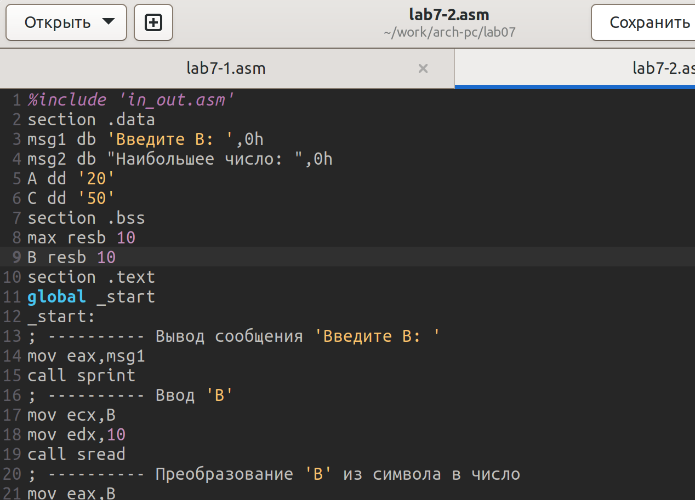{#fig:009 width=80%}

Создаю исполняемый файл и проверяю его работу для разных значений B.Создаю исполняемый файл и проверяю его работу(рис. [-@fig:010]). Все работает правильно.

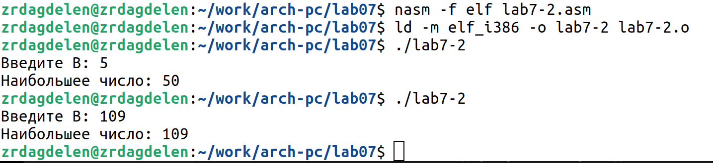{#fig:010 width=80%}

В данном примере переменные A и С сравниваются как символы, а
переменная B и маx(A, С) как числа.

## Изучение структуры файлы листинга

4. Обычно nasm создаёт в результате ассемблирования только объектный файл. Получить
файл листинга можно, указав ключ -l и задав имя файла листинга в командной строке.
Создаю файл листинга для программы из файла lab7-2.asm и открываю файл листинга lab7-2.lst с помощью текстового редактора mcedit(рис. [-@fig:011]).

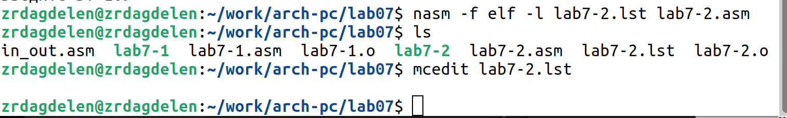{#fig:011 width=80%}


Объяснение содержимое трёх строк файла листинга (рис. [-@fig:012]):

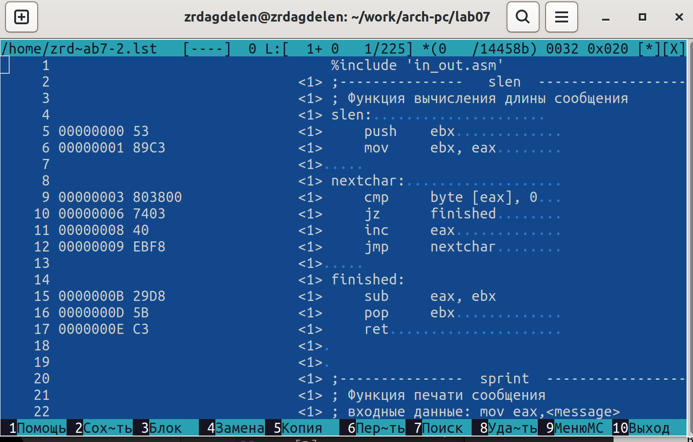{#fig:012 width=80%}

"1" - номер строки кода, "%include in_out.asm" - подключение внешнего файла in_out.asm,
программа использует этот файл, чтобы выполнять некоторые дальнейшие функции.

"2" - номер строки кода, "; Функция вычисления длинны сообщения" - комментарий к коду, не имеет адреса и машинного кода.

"4" - номер строки кода, "00000000" - адрес строки, "53" - машинный код, "push ebx" - исходный текст программы, инструкция "push" помещает операнд "ebx" в стек.

Открываю файл с программой lab7-2.asm и в одной инструкции с двумя операндами
удаляю один операнд (рис. [-@fig:013]):

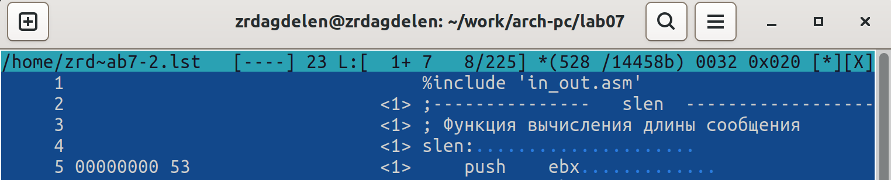{#fig:013 width=80%}

Выполняю трансляцию с получением файла листинга (рис. [-@fig:014]):

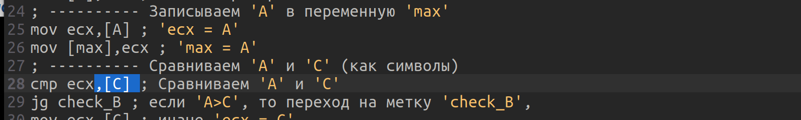{#fig:014 width=80%}

Результат (рис. [-@fig:015]):

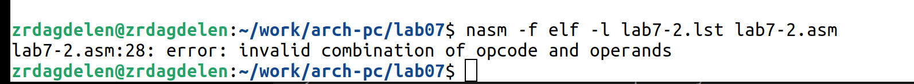{#fig:015 width=80%}

На выходе получается ни один файлн из-за ошибки: инструкция cmp не может работать (не с чем сравнить), имея только один операнд, из-за чего нарушается работа кода.

## Задание для самостоятельной работы

1. Напишу программу нахождения наименьшей из 3 целочисленных переменных 𝑎,𝑏 и .
Значения переменных нужно выбрать из табл. 7.5 в соответствии с вариантом, полученным
при выполнении лабораторной работы № 6 -- у меня 13-ый вариант. Создаю файл variant-13.asm с помощью touch и пишу программу(рис. [-@fig:016] - рис. [-@fig:017]):

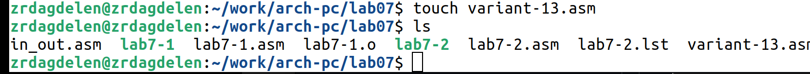{#fig:016 width=80%} 

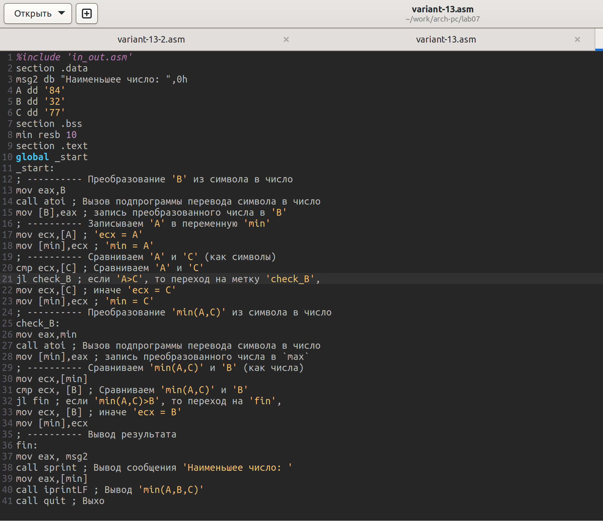{#fig:017 width=80%} 

Создаю исполняемый файл и проверяю его работу (рис. [-@fig:018]):

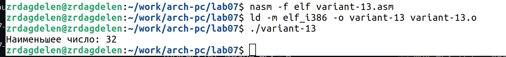{#fig:018 width=80%}

Код программы:

``` NASM
%include 'in_out.asm'
section .data
msg2 db "Наименьшее число: ",0h
A dd '84'
B dd '32'
C dd '77'
section .bss
min resb 10
section .text
global _start
_start:
; ---------- Преобразование 'B' из символа в число
mov eax,B
call atoi ; Вызов подпрограммы перевода символа в число
mov [B],eax ; запись преобразованного числа в 'B'
; ---------- Записываем 'A' в переменную 'min'
mov ecx,[A] ; 'ecx = A'
mov [min],ecx ; 'min = A'
; ---------- Сравниваем 'A' и 'С' (как символы)
cmp ecx,[C] ; Сравниваем 'A' и 'С'
jl check_B ; если 'A>C', то переход на метку 'check_B',
mov ecx,[C] ; иначе 'ecx = C'
mov [min],ecx ; 'min = C'
; ---------- Преобразование 'min(A,C)' из символа в число
check_B:
mov eax,min
call atoi ; Вызов подпрограммы перевода символа в число
mov [min],eax ; запись преобразованного числа в `max`
; ---------- Сравниваем 'min(A,C)' и 'B' (как числа)
mov ecx,[min]
cmp ecx, [B] ; Сравниваем 'min(A,C)' и 'B'
jl fin ; если 'min(A,C)>B', то переход на 'fin',
mov ecx, [B] ; иначе 'ecx = B'
mov [min],ecx
; ---------- Вывод результата
fin:
mov eax, msg2
call sprint ; Вывод сообщения 'Наименьшее число: '
mov eax,[min]
call iprintLF ; Вывод 'min(A,B,C)'
call quit ; Выход
```

2. Напишу программу, которая для введенных с клавиатуры значений x и a вычисляет
значение заданной функции f(x) и выводит результат вычислений. 
Создаю файл variant-13-2.asm с помощью touch (рис. [-@fig:019]):

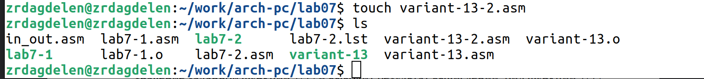{#fig:019 width=80%}

Пишу код программы и создаю исполняемый файл и проверяю
его работу для значений x=3, a=9  и x=4, a=6(рис. [-@fig:020]). Все работает верно.


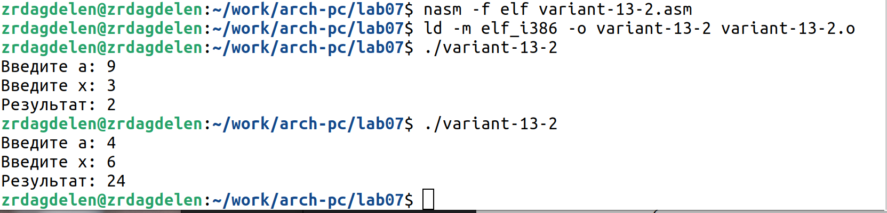{#fig:020 width=80%} 

Код программы:

```NASM
%include 'in_out.asm'
section .data
msg1 db 'Введите x: ',0h
msg2 db 'Введите a: ',0h
msg3 db "Результат: ",0h
section .bss
rez resb 80
rez2 resb 80
a resb 80
x resb 80
section .text
global _start
_start:
; ---------- Вывод сообщения 'Введите a: '
mov eax, msg2
call sprint
; ---------- Ввод 'a'
mov ecx, a
mov edx, 80
call sread
;--------------
; ---------- Преобразование 'a' из символа в число
mov eax, a
call atoi ; Вызов подпрограммы перевода символа в число
mov [a], eax
; ---------- Вывод сообщения 'Введите x: '
mov eax, msg1
call sprint
; ---------- Ввод 'x'
mov ecx, x
mov edx, 80
call sread
; ---------- Преобразование 'x' из символа в число
mov eax, x
call atoi ; Вызов подпрограммы перевода символа в число
mov [x], eax

mov eax, [a]
add eax, -7; a=a-7
mov [rez], eax ; 'rez = a-7'

; ---------- Сравниваем a и 7
mov ecx, [a]
cmp ecx, 7 ; Сравниваем a и 7
jge fin; если 'a>=7', то переход на метку 'fin',
jmp f_x


f_x:
mov edi, [a]
mov eax, [x]
mul edi
mov [rez2], eax
jmp fin2

fin:
mov eax, msg3
call sprint ; Вывод сообщения 
mov eax, [rez]
call iprintLF ; Вывод 'rez'
jmp fin3

fin2:
mov eax, msg3
call sprint ; Вывод сообщения 
mov eax, [rez2]
call iprintLF ; Вывод 'rez2'
jmp fin3

fin3:
call quit ; Выход
```


# Выводы

Я изучила команды условного и безусловного переходов, приобрела навыки написания
программ с использованием переходов. Познакомилась с назначением и структурой файла
листинга.

# Список литературы

[Архитектура ЭВМ](https://esystem.rudn.ru/pluginfile.php/2089087/mod_resource/content/0/%D0%9B%D0%B0%D0%B1%D0%BE%D1%80%D0%B0%D1%82%D0%BE%D1%80%D0%BD%D0%B0%D1%8F%20%D1%80%D0%B0%D0%B1%D0%BE%D1%82%D0%B0%20%E2%84%967.%20%D0%9A%D0%BE%D0%BC%D0%B0%D0%BD%D0%B4%D1%8B%20%D0%B1%D0%B5%D0%B7%D1%83%D1%81%D0%BB%D0%BE%D0%B2%D0%BD%D0%BE%D0%B3%D0%BE%20%D0%B8%20%D1%83%D1%81%D0%BB%D0%BE%D0%B2%D0%BD%D0%BE%D0%B3%D0%BE%20%D0%BF%D0%B5%D1%80%D0%B5%D1%85%D0%BE%D0%B4%D0%BE%D0%B2%20%D0%B2%20Nasm.%20%D0%9F%D1%80%D0%BE%D0%B3%D1%80%D0%B0%D0%BC%D0%BC%D0%B8%D1%80%D0%BE%D0%B2%D0%B0%D0%BD%D0%B8%D0%B5%20%D0%B2%D0%B5%D1%82%D0%B2%D0%BB%D0%B5%D0%BD%D0%B8%D0%B9..pdf)

