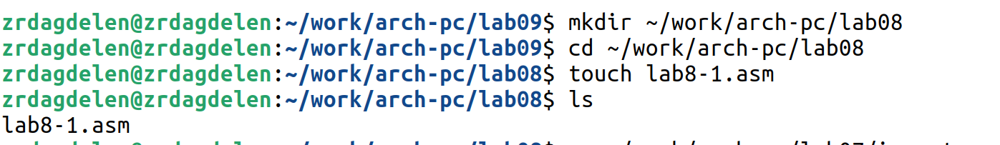

---
## Front matter
title: "Программирование
цикла. Обработка аргументов командной строки."
subtitle: "Лабораторная работа №8. "
author: "Дагделен Зейнап Реджеповна"

## Generic otions
lang: ru-RU
toc-title: "Содержание"

## Bibliography
bibliography: bib/cite.bib
csl: pandoc/csl/gost-r-7-0-5-2008-numeric.csl

## Pdf output format
toc: true # Table of contents
toc-depth: 2
lof: true # List of figures
lot: true # List of tables
fontsize: 12pt
linestretch: 1.5
papersize: a4
documentclass: scrreprt
## I18n polyglossia
polyglossia-lang:
  name: russian
  options:
	- spelling=modern
	- babelshorthands=true
polyglossia-otherlangs:
  name: english
## I18n babel
babel-lang: russian
babel-otherlangs: english
## Fonts
mainfont: PT Serif
romanfont: PT Serif
sansfont: PT Sans
monofont: PT Mono
mainfontoptions: Ligatures=TeX
romanfontoptions: Ligatures=TeX
sansfontoptions: Ligatures=TeX,Scale=MatchLowercase
monofontoptions: Scale=MatchLowercase,Scale=0.9
## Biblatex
biblatex: true
biblio-style: "gost-numeric"
biblatexoptions:
  - parentracker=true
  - backend=biber
  - hyperref=auto
  - language=auto
  - autolang=other*
  - citestyle=gost-numeric
## Pandoc-crossref LaTeX customization
figureTitle: "Рис."
tableTitle: "Таблица"
listingTitle: "Листинг"
lofTitle: "Список иллюстраций"
lotTitle: "Список таблиц"
lolTitle: "Листинги"
## Misc options
indent: true
header-includes:
  - \usepackage{indentfirst}
  - \usepackage{float} # keep figures where there are in the text
  - \floatplacement{figure}{H} # keep figures where there are in the text
---

# Цель работы

Приобретение навыков написания программ с использованием циклов и обработкой аргументов командной строки.

# Задание

1. Реализация циклов в NASM
2. Обработка аргументов командной строки
3. Задание для самостаятельной работы 

# Теоретическое введение

## Организация стека
Стек — это структура данных, организованная по принципу LIFO («Last In — First Out» или «последним пришёл — первым ушёл»). Стек является частью архитектуры процессора и
реализован на аппаратном уровне. Для работы со стеком в процессоре есть специальные
регистры (ss, bp, sp) и команды.
Основной функцией стека является функция сохранения адресов возврата и передачи
аргументов при вызове процедур. Кроме того, в нём выделяется память для локальных
переменных и могут временно храниться значения регистров.
Стек имеет вершину, адрес последнего добавленного элемента, который хранится в регистре esp (указатель стека). Противоположный конец стека называется дном. Значение, помещённое в стек последним, извлекается первым. При помещении значения в стек указатель стека уменьшается, а при извлечении — увеличивается.
Для стека существует две основные операции:
- добавление элемента в вершину стека (push);
- извлечение элемента из вершины стека (pop).

###  Добавление элемента в стек.

Команда push размещает значение в стеке, т.е. помещает значение в ячейку памяти, на
которую указывает регистр esp, после этого значение регистра esp увеличивается на 4.
Данная команда имеет один операнд — значение, которое необходимо поместить в стек.

Существует ещё две команды для добавления значений в стек. Это команда pusha, которая помещает в стек содержимое всех регистров общего назначения в следующем порядке: ах, сх, dx, bх, sp, bp, si, di. А также команда pushf, которая служит для перемещения в стек
содержимого регистра флагов. Обе эти команды не имеют операндов.

###  Извлечение элемента из стека.

Команда pop извлекает значение из стека, т.е. извлекает значение из ячейки памяти, на
которую указывает регистр esp, после этого уменьшает значение регистра esp на 4. У этой
команды также один операнд, который может быть регистром или переменной в памяти.
Нужно помнить, что извлечённый из стека элемент не стирается из памяти и остаётся как
“мусор”, который будет перезаписан при записи нового значения в стек.

##  Инструкции организации циклов

Для организации циклов существуют специальные инструкции. Для всех инструкций
максимальное количество проходов задаётся в регистре ecx. Наиболее простой является инструкция loop. Она позволяет организовать безусловный цикл, типичная структура которого
имеет следующий вид: \
mov ecx, 100 ; Количество проходов \
NextStep: \
... \
... ; тело цикла \
... \
loop NextStep ; Повторить `ecx` раз от метки NextStep \
Иструкция loop выполняется в два этапа. Сначала из регистра ecx вычитается единица и
его значение сравнивается с нулём. Если регистр не равен нулю, то выполняется переход к
указанной метке. Иначе переход не выполняется и управление передаётся команде, которая
следует сразу после команды loop.

# Выполнение лабораторной работы

## Реализация циклов в NASM
Создаю каталог для программам лабораторной работы № 8 с помощью mkdir, перехожу в него (команда cd) и создаю файл lab8-1.asm с помощью touch (рис. [-@fig:001]).

{#fig:001 width=75%}

Так как для дальшейней работы программ я буду использовать внешний файл in_iut.asm, то его необходимо скопировать в папку, в которой я работаю на данный момент (рис. [-@fig:002]).

{#fig:002 width=75%}

Инструкция loop использует регистр ecx в качестве счетчика и на каждом шаге уменьшает его значение на единицу. Ввожу в файл lab8-1.asm текст программы из листинга 8.1(рис. [-@fig:003]).

{#fig:003 width=75%}

Создаю исполняемый файл и проверяю его работу(рис. [-@fig:004]).

{#fig:004 width=75%}

Данный пример показывает, что использование регистра ecx в теле цилка loop может привести к некорректной работе программы. Изменяю текст программы добавив изменение значение регистра ecx в цикле(рис. [-@fig:005]).

{#fig:005 width=75%}

Создаю исполняемый файл и проверяю его работу(рис. [-@fig:006] - [-@fig:007]).

{#fig:006 width=75%}

{#fig:007 width=75%}

В итоге я создала бесконечный цикл. Число проходов цикла не соответствует значению N введенному с клавиатуры.

Для использования регистра ecx в цикле и сохранения корректности работы программы использую стек. Вношу изменения в текст программы добавив команды push и pop для сохранения значения счетчика цикла
loop. Создаю исполняемый файл и проверяю его работу(рис. [-@fig:008]).

{#fig:008 width=75%}

В этот раз число проходов цикла соответствует значению N, введенному с клавиатуры.

## Обработка аргументов командной строки
При разработке программ иногда необходимо указывать аргументы, которые будут использоваться в программе, непосредственно из командной строки при запуске программы.
При запуске программы в NASM аргументы командной строки загружаются в стек в обратном порядке, кроме того в стек записывается имя программы и общее количество аргументов.
Последние два элемента стека для программы, скомпилированной NASM, – это всегда имя программы и количество переданных аргументов.
Таким образом, для того чтобы использовать аргументы в программе, их просто нужно извлечь из стека. Обработку аргументов нужно проводить в цикле.
Напишем программу, которая выводит на экран
аргументы командной строки. Создаю файл lab8-2.asm в каталоге ~/work/arch-pc/lab08 и ввожу в него текст программы из листинга 8.2 (рис. [-@fig:009]-[-@fig:010]).

{#fig:009 width=75%}

{#fig:010 width=75%}

Создаю исполняемый файл и запускаю его, указав аргументы: аргумент1 аргумент 2 'аргумент 3' (рис. [-@fig:011]).

{#fig:011 width=75%}

Сколько аргументов было обработано программой? 4 аргумента: каждое аргумент принимается через пробел, а последний аргумент написан в кавычках, из-за чего все, что внутри кавычек воспринимается программой как одна единая строка-аргумент.
Напишем программу, которая выводит сумму чисел, которые передаются в программу как аргументы. Создаю файл lab8-3.asm в каталоге ~/work/arch-pc/lab08 и ввожу в него текст программы из листинга 8.3 (рис. [-@fig:012]-[-@fig:013]).

{#fig:012 width=75%}

{#fig:013 width=75%}

Создаю исполняемый файл и запускаю его, указав аргументы (2, 13, 7, 10, 5) (рис. [-@fig:014]).

{#fig:014 width=75%}

Программа работает верно.\
Изменяю текст программы из листинга 8.3 для вычисления произведения аргументов командной строки(рис. [-@fig:015]).

{#fig:015 width=75%}

Текст программы:

```NASM
%include 'in_out.asm'
SECTION .data
msg db "Результат: ",0
SECTION .text
global _start
_start:
pop ecx ; Извлекаем из стека в `ecx` количество
; аргументов (первое значение в стеке)
pop edx ; Извлекаем из стека в `edx` имя программы
; (второе значение в стеке)
sub ecx,1 ; Уменьшаем `ecx` на 1 (количество
; аргументов без названия программы)
mov esi, 1 ; Используем `esi` для хранения
; промежуточных произведений
next:
cmp ecx,0h ; проверяем, есть ли еще аргументы
jz _end ; если аргументов нет выходим из цикла
; (переход на метку `_end`)
pop eax ; иначе извлекаем следующий аргумент из стека
call atoi ; преобразуем символ в число
mul esi ; добавляем к промежуточному произведению
mov esi, eax
; след. аргумент `eax=esi*eax`
loop next ; переход к обработке следующего аргумента
_end:
mov eax, msg ; вывод сообщения "Результат: "
call sprint
mov eax, esi ; записываем произведение в регистр `eax`
call iprintLF ; печать результата
call quit ; завершение программ
```

Создаю исполняемый файл и запускаю его, указав аргументы (рис. [-@fig:016]).

{#fig:016 width=75%}

Все работает верно.

## Задание для самостоятельной работы
1. Напишу программу, которая находит сумму значений функции f(x) для
x=x_1, x_2, ..., x_n, т.е. программа должна выводить значение f(x_1) + f(x_2) + ... + f(x_n). \
Так как у меня 13 вариант был при выполнении 6 лабораторной, то пишу программу для функции: f(x)=12x − 7. Создаю файл var13.asm с помощью touch и ввожу текст программы (рис. [-@fig:017]-[-@fig:018]).

{#fig:017 width=75%}

{#fig:018 width=75%}

Текст программы:
```NASM
%include 'in_out.asm'
SECTION .data
msg db "Результат: ",0
SECTION .text
global _start
_start:
pop ecx ; Извлекаем из стека в `ecx` количество
; аргументов (первое значение в стеке)
pop edx ; Извлекаем из стека в `edx` имя программы
; (второе значение в стеке)
sub ecx,1 ; Уменьшаем `ecx` на 1 (количество
; аргументов без названия программы)
mov esi, 0 ; Используем `esi` для хранения
; промежуточных сумм
next:
cmp ecx,0h ; проверяем, есть ли еще аргументы
jz _end ; если аргументов нет выходим из цикла
; (переход на метку `_end`)
pop eax ; иначе извлекаем следующий аргумент из стека
call atoi ; преобразуем символ в число
mov edi, 12
mul edi
add eax, -7
add esi,eax ; добавляем к промежуточной сумме
; след. аргумент `esi=esi+eax`
loop next ; переход к обработке следующего аргумента
_end:
mov eax, msg ; вывод сообщения "Результат: "
call sprint
mov eax, esi ; записываем сумму в регистр `eax`
call iprintLF ; печать результата
call quit ; завершение программы
```
Создаю исполняемый файл и проверяю его работу на
нескольких наборах x=x_1, x_2, ..., x_n (рис. [-@fig:019]).

{#fig:019 width=75%}

Программа работает верно.

# Выводы

Я приобрела навыкы написания программ с использованием циклов и обработкой аргументов командной строки.

# Список литературы

[Архитектура ЭВМ](https://esystem.rudn.ru/pluginfile.php/2089095/mod_resource/content/0/%D0%9B%D0%B0%D0%B1%D0%BE%D1%80%D0%B0%D1%82%D0%BE%D1%80%D0%BD%D0%B0%D1%8F%20%D1%80%D0%B0%D0%B1%D0%BE%D1%82%D0%B0%20%E2%84%968.%20%D0%9F%D1%80%D0%BE%D0%B3%D1%80%D0%B0%D0%BC%D0%BC%D0%B8%D1%80%D0%BE%D0%B2%D0%B0%D0%BD%D0%B8%D0%B5%20%D1%86%D0%B8%D0%BA%D0%BB%D0%B0.%20%D0%9E%D0%B1%D1%80%D0%B0%D0%B1%D0%BE%D1%82%D0%BA%D0%B0%20%D0%B0%D1%80%D0%B3%D1%83%D0%BC%D0%B5%D0%BD%D1%82%D0%BE%D0%B2%20%D0%BA%D0%BE%D0%BC%D0%B0%D0%BD%D0%B4%D0%BD%D0%BE%D0%B9%20%D1%81%D1%82%D1%80%D0%BE%D0%BA%D0%B8..pdf)
