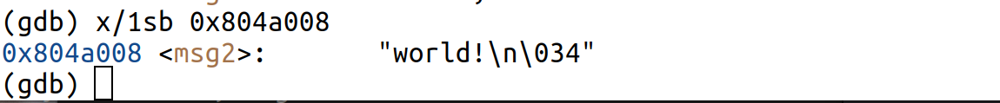
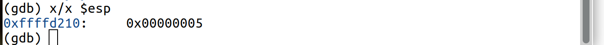
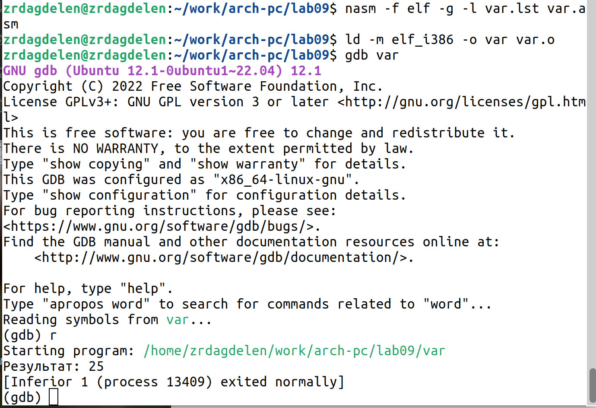

---
## Front matter
title: "Понятие подпрограммы.
Отладчик GDB."
subtitle: "Лабораторная работа №9."
author: "Дагделен Зейнап Реджеповна"

## Generic otions
lang: ru-RU
toc-title: "Содержание"

## Bibliography
bibliography: bib/cite.bib
csl: pandoc/csl/gost-r-7-0-5-2008-numeric.csl

## Pdf output format
toc: true # Table of contents
toc-depth: 2
lof: true # List of figures
lot: true # List of tables
fontsize: 12pt
linestretch: 1.5
papersize: a4
documentclass: scrreprt
## I18n polyglossia
polyglossia-lang:
  name: russian
  options:
	- spelling=modern
	- babelshorthands=true
polyglossia-otherlangs:
  name: english
## I18n babel
babel-lang: russian
babel-otherlangs: english
## Fonts
mainfont: PT Serif
romanfont: PT Serif
sansfont: PT Sans
monofont: PT Mono
mainfontoptions: Ligatures=TeX
romanfontoptions: Ligatures=TeX
sansfontoptions: Ligatures=TeX,Scale=MatchLowercase
monofontoptions: Scale=MatchLowercase,Scale=0.9
## Biblatex
biblatex: true
biblio-style: "gost-numeric"
biblatexoptions:
  - parentracker=true
  - backend=biber
  - hyperref=auto
  - language=auto
  - autolang=other*
  - citestyle=gost-numeric
## Pandoc-crossref LaTeX customization
figureTitle: "Рис."
tableTitle: "Таблица"
listingTitle: "Листинг"
lofTitle: "Список иллюстраций"
lotTitle: "Список таблиц"
lolTitle: "Листинги"
## Misc options
indent: true
header-includes:
  - \usepackage{indentfirst}
  - \usepackage{float} # keep figures where there are in the text
  - \floatplacement{figure}{H} # keep figures where there are in the text
---

# Цель работы

Приобретение навыков написания программ с использованием подпрограмм. Знакомство
с методами отладки при помощи GDB и его основными возможностями.

# Задание

1. Реализация подпрограмм в NASM.

2. Отладка программам с помощью GDB.

3. Добавление точек останова.

4. Работа с данными программы в GDB.

5. Обработка аргументов командной строки в GDB.

6. Задания для самостоятельной работы.

# Теоретическое введение

Отладка — это процесс поиска и исправления ошибок в программе. Отладчики позволяют управлять ходом выполнения программы, контролировать и изменять данные. Это помогает быстрее найти место ошибки в программе и ускорить её
исправление. Наиболее популярные способы работы с отладчиком — это использование
точек останова и выполнение программы по шагам.

GDB (GNU Debugger — отладчик проекта GNU) работает на многих UNIX-подобных
системах и умеет производить отладку многих языков программирования. GDB предлагает
обширные средства для слежения и контроля за выполнением компьютерных программ. Отладчик не содержит собственного графического пользовательского интерфейса и использует стандартный текстовый интерфейс консоли. Однако для GDB существует несколько сторонних графических надстроек, а кроме того, некоторые интегрированные среды разработки используют его в качестве базовой подсистемы отладки.

Отладчик GDB (как и любой другой отладчик) позволяет увидеть, что происходит «внутри»
программы в момент её выполнения или что делает программа в момент сбоя.

Команда run (сокращённо r) — запускает отлаживаемую программу в оболочке GDB.

Команда kill (сокращённо k) прекращает отладку программы, после чего следует вопрос
о прекращении процесса отладки. Если в ответ введено y (то есть «да»), отладка программы прекращается. Командой run её можно начать заново, при этом все точки останова (breakpoints), точки просмотра (watchpoints) и точки отлова (catchpoints) сохраняются.

Для выхода из отладчика используется команда quit (или сокращённо q).

Если есть файл с исходным текстом программы, а в исполняемый файл включена информация о номерах строк исходного кода, то программу можно отлаживать, работая в отладчике
непосредственно с её исходным текстом. Чтобы программу можно было отлаживать на
уровне строк исходного кода, она должна быть откомпилирована с ключом -g.

Установить точку останова можно командой break (кратко b). Типичный аргумент этой
команды — место установки. Его можно задать как имя метки или как адрес. Чтобы не было путаницы с номерами, перед адресом ставится «звёздочка».

Информацию о всех установленных точках останова можно вывести командой info (кратко i).

Для того чтобы сделать неактивной какую-нибудь ненужную точку останова, можно воспользоваться командой disable.

Обратно точка останова активируется командой enable.

Если же точка останова в дальнейшем больше не нужна, она может быть удалена с помощью
команды delete.

Для продолжения остановленной программы используется команда continue (c). Выполнение программы будет происходить до следующей точки останова.
В качестве аргумента может использоваться целое число N, которое указывает отладчику
проигнорировать N − 1 точку останова (выполнение остановится на N-й точке).

Команда stepi (кратко sI) позволяет выполнять программу по шагам, т.е. данная команда
выполняет ровно одну инструкцию.

Подпрограмма — это, как правило, функционально законченный участок кода, который
можно многократно вызывать из разных мест программы. В отличие от простых переходов
из подпрограмм существует возврат на команду, следующую за вызовом. Если в программе встречается одинаковый участок кода, его можно оформить в виде подпрограммы, а во всех нужных местах поставить её вызов. При этом подпрограмма будет содержаться в коде в одном экземпляре, что позволит уменьшить размер кода всей программы.

Для вызова подпрограммы из основной программы используется инструкция call, которая заносит адрес следующей инструкции в стек и загружает в регистр eip адрес соответствующей подпрограммы, осуществляя таким образом переход. Затем начинается выполнение подпрограммы, которая, в свою очередь, также может содержать подпрограммы.
Подпрограмма завершается инструкцией ret, которая извлекает из стека адрес, занесённый туда соответствующей инструкцией call, и заносит его в eip. После этого выполнение основной программы возобновится с инструкции, следующей за инструкцией call.

# Выполнение лабораторной работы

## Реализация подпрограмм в NASM

Создаю каталог для выполнения лабораторной работы № 9 с помощью mkdir, перехожу в него (утилита cd) и создаю файл lab09-1.asm благодаря touch. (рис. [-@fig:001])

{#fig:001 width=70%}

Ввожу в файл lab09-1.asm текст программы с использованием подпрограммы из листинга 9.1. (рис. [-@fig:002])

{#fig:002 width=70%}

Создаю исполняемый файл и проверяю его работу. (рис. [-@fig:003])

{#fig:003 width=70%}

Изменяю текст программы, добавив подпрограмму _subcalcul в подпрограмму _calcul
для вычисления выражения f(g(x)), где x вводится с клавиатуры, f(x) = 2x + 7, g(x) =
3x − 1. (рис. [-@fig:004])

{#fig:004 width=70%}

Создаю исполняемый файл и проверяю его работу. (рис. [-@fig:005])

{#fig:005 width=70%}

## Отладка программам с помощью GDB

Создаю файл lab09-2.asm (с помощью touch) и ввожу в него текст программы из Листинга 9.2. (рис. [-@fig:006]- [-@fig:007])

{#fig:006 width=70%}

{#fig:007 width=70%}

Получаю исполняемый файл для работы с GDB с ключом ‘-g’, загружаю исполняемый файл в отладчик gdb и проверяю работу программы, запустив ее в оболочке GDB с помощью команды run(рис. [-@fig:008]).

{#fig:008 width=70%}

Для более подробного анализа программы устанавливаю брейкпоинт на метку _start и запускаю её (рис. [-@fig:009]).

{#fig:009 width=70%}


Просматриваю дисассимилированный код программы с помощью команды disassemble, начиная с метки _start [-@fig:010], и переключаюсь на отображение команд с синтаксисом Intel, введя команду set disassembly-flavor intel (рис. [-@fig:011]).

{#fig:010 width=70%}

{#fig:011 width=70%}


В режиме ATT имена регистров начинаются с символа %, а имена операндов с $, в то время как в Intel используется привычный нам синтаксис.

Включаю режим псевдографики для более удобного анализа программы с помощью команд layout asm и layout regs (рис. [-@fig:012]).

{#fig:012 width=70%}

### Добавление точек останова

Проверяю, что точка останова по имени метки _start установлена с помощью команды info breakpoints (i b) и устанавливаю еще одну точку останова по адресу инструкции mov ebx,0x0. Просматриваю информацию о всех установленных точках останова (рис. [-@fig:013]-[-@fig:014]).

{#fig:013 width=70%}

{#fig:014 width=70%}

### Работа с данными программы в GDB

Выполняю 5 инструкций с помощью команды stepi и слежу за изменением значений регистров. (рис. [-@fig:015])

{#fig:015 width=70%}

Изменились значения регистров eax, ecx, edx и ebx.

Просматриваю значение переменной msg1 по имени с помощью команды x/1sb &msg1 и значение переменной msg2 по ее адресу. (рис. [-@fig:016]-[-@fig:017])

{#fig:016 width=70%}

{#fig:017 width=70%}

С помощью команды set изменяю первый символ переменной msg1 и заменяю первый символ в переменной msg2. (рис. [-@fig:018]-[-@fig:019])

{#fig:018 width=70%}

{#fig:019 width=70%}

С помощью команды set изменяю значение регистра ebx в соответствии с заданием (рис. [-@fig:020]-[-@fig:021] ).

{#fig:020 width=70%}

{#fig:021 width=70%}

Разница вывода команд p/s $ebx отличается тем, что в первом случае мы переводим символ в его строковый вид, а во втором случае число в строковом виде не изменяется.

Завершаю выполнение программы с помощью команды continue (с) и выхожу из GDB с помощью команды quit (q). (рис. [-@fig:022])

{#fig:022 width=70%}

### Обработка аргументов командной строки в GDB

Копирую файл lab8-2.asm с программой из листинга 8.2 в файл с именем lab09-3.asm и создаю исполняемый файл. (рис. [-@fig:023])

{#fig:023 width=70%}

Создаю исполняемый файл(рис. [-@fig:024]).

{#fig:024 width=70%}

Загружаю исполняемый файл в отладчик gdb, указывая необходимые аргументы с использованием ключа --args. (рис. [-@fig:025])

{#fig:025 width=70%}

Устанавливаю точку останова перед первой инструкцией в программе и запускаю ее. (рис. [-@fig:026])

{#fig:026 width=70%}

Посматриваю вершину стека (рис. [-@fig:027]).

{#fig:027 width=70%}

Число аргументов равно 5 – это имя программы lab09-3 и непосредственно
аргументы: аргумент1, аргумент, 2 и 'аргумент 3'.

Посмотрю остальные позиции стека – по адесу [esp+4] располагается адрес в памяти, где находиться имя программы, по адесу [esp+8] храниться адрес первого аргумента, по
аресу [esp+12] – второго и т.д. ((рис. [-@fig:028]))

{#fig:028 width=70%}

Шаг изменения адреса равен 4, т.к количество аргументов командной строки = 4.

## Задания для самостоятельной работы

1. Преобразовываю программу из лабораторной работы №8 (Задание №1 для самостоятельной работы), реализовав вычисление значения функции f(x) как подпрограмму (рис. [-@fig:029]). Для этого сначала копирую из lab06 нужный мне файл в нынешнюю папку(рис. [-@fig:030]).

{#fig:029 width=70%}

{#fig:030 width=70%}

Создаю исполняемый файл (рис. [-@fig:031]), запускаю код и проверяю, что она работает корректно(рис. [-@fig:032]). 

{#fig:031 width=70%}

{#fig:032 width=70%}

Код программы:

``` NASM
%include 'in_out.asm'
SECTION .data
msg db "Результат: ",0
SECTION .text
global _start
_start:
pop ecx 
pop edx 
sub ecx,1 
mov esi, 0 
next:
cmp ecx,0h 
jz _end 
pop eax
call atoi
mov edi, 12
mul edi
add eax, -7
add esi,eax
loop next
_end:
mov eax, msg 
call sprint
mov eax, esi
call iprintLF 
call quit 
```

2. Создаю файл (рис. [-@fig:033]) и ввожу в файл task1.asm текст программы из листинга 9.3. (рис. [-@fig:034])

{#fig:033 width=70%}

{#fig:034 width=70%}

При корректной работе программы должно выводится "25". Создаю исполняемый файл и запускаю его (рис. [-@fig:035]-[-@fig:036]).

{#fig:035 width=70%}

{#fig:036 width=70%}


Видим, что мы получили неправильный ответ.

Получаю исполняемый файл для работы с GDB, запускаю его и ставлю брейкпоинты для некоторых инструкций, связанной с вычислениями. С помощью команды continue прохожусь по каждому брейкпоинту и слежу за изменениями значений регистров.

При выполнении инструкции mul ecx происходит умножение ecx на eаx, то есть 4 на 2, вместо умножения 4 на 5 (регистр ebx). Происходит это из-за того, что стоящая перед mov ecx,4 инструкция add ebx,eax не связана с mul ecx, но связана инструкция mov eax,2 (рис. [-@fig:037]-[-@fig:038]).

{#fig:037 width=70%}

{#fig:037 width=70%}

Из-за этого я получаю неправильный ответ.

Исправляю ошибку, изменив add ebx,eax  на add eax, ebx и заменяя ebx на eax в инструкциях add ebx,5 и mov edi,ebx (рис. [-@fig:039]).

{#fig:039 width=70%}

Создаю исполняемый файл и запускаем его. Убеждаюсь, что ошибка исправлена (рис. [-@fig:040]). 

{#fig:040 width=70%}

Код программы:

```NASM
%include 'in_out.asm'
SECTION .data
div: DB 'Результат: ',0
SECTION .text
GLOBAL _start
_start:
; ---- Вычисление выражения (3+2)*4+5
mov ebx,3
mov eax,2
add eax,ebx
mov ecx,4
mul ecx
add eax,5
mov edi,eax
; ---- Вывод результата на экран
mov eax,div
call sprint
mov eax,edi
call iprintLF
call quit

```

# Выводы

Я приобрела навыки написания программ с использованием подпрограмм и ознакомилась с методами отладки при помощи GDB и его основными возможностями.

# Список литературы
[Архитектура ЭВМ](https://esystem.rudn.ru/pluginfile.php/2089096/mod_resource/content/0/%D0%9B%D0%B0%D0%B1%D0%BE%D1%80%D0%B0%D1%82%D0%BE%D1%80%D0%BD%D0%B0%D1%8F%20%D1%80%D0%B0%D0%B1%D0%BE%D1%82%D0%B0%20%E2%84%969.%20%D0%9F%D0%BE%D0%BD%D1%8F%D1%82%D0%B8%D0%B5%20%D0%BF%D0%BE%D0%B4%D0%BF%D1%80%D0%BE%D0%B3%D1%80%D0%B0%D0%BC%D0%BC%D1%8B.%20%D0%9E%D1%82%D0%BB%D0%B0%D0%B4%D1%87%D0%B8%D0%BA%20..pdf)

