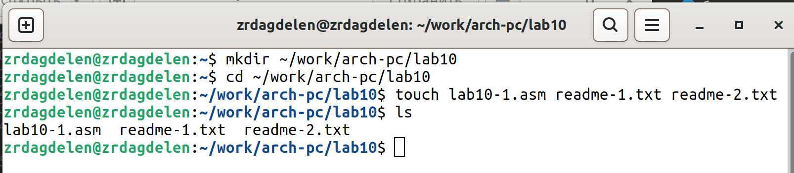

---
## Front matter
title: "Работа с файлами
средствами Nasm"
subtitle: "Лабораторная работа №10."
author: "Дагделен Зейнап Реджеповна"

## Generic otions
lang: ru-RU
toc-title: "Содержание"

## Bibliography
bibliography: bib/cite.bib
csl: pandoc/csl/gost-r-7-0-5-2008-numeric.csl

## Pdf output format
toc: true # Table of contents
toc-depth: 2
lof: true # List of figures
lot: true # List of tables
fontsize: 12pt
linestretch: 1.5
papersize: a4
documentclass: scrreprt
## I18n polyglossia
polyglossia-lang:
  name: russian
  options:
	- spelling=modern
	- babelshorthands=true
polyglossia-otherlangs:
  name: english
## I18n babel
babel-lang: russian
babel-otherlangs: english
## Fonts
mainfont: PT Serif
romanfont: PT Serif
sansfont: PT Sans
monofont: PT Mono
mainfontoptions: Ligatures=TeX
romanfontoptions: Ligatures=TeX
sansfontoptions: Ligatures=TeX,Scale=MatchLowercase
monofontoptions: Scale=MatchLowercase,Scale=0.9
## Biblatex
biblatex: true
biblio-style: "gost-numeric"
biblatexoptions:
  - parentracker=true
  - backend=biber
  - hyperref=auto
  - language=auto
  - autolang=other*
  - citestyle=gost-numeric
## Pandoc-crossref LaTeX customization
figureTitle: "Рис."
tableTitle: "Таблица"
listingTitle: "Листинг"
lofTitle: "Список иллюстраций"
lotTitle: "Список таблиц"
lolTitle: "Листинги"
## Misc options
indent: true
header-includes:
  - \usepackage{indentfirst}
  - \usepackage{float} # keep figures where there are in the text
  - \floatplacement{figure}{H} # keep figures where there are in the text
---

# Цель работы

Приобретение навыков написания программ для работы с файлами.

# Задание

1. Написание программ для работы с файлами.
2. Задание для самостоятельной работы.


# Теоретическое введение

## Права доступа к файлам

ОС GNU/Linux является многопользовательской операционной системой. И для обеспечения защиты данных одного пользователя от действий других пользователей существуют
специальные механизмы разграничения доступа к файлам. Кроме ограничения доступа, данный механизм позволяет разрешить другим пользователям доступ данным для совместной
работы.
Права доступа определяют набор действий (чтение, запись, выполнение), разрешённых
для выполнения пользователям системы над файлами. Для каждого файла пользователь
может входить в одну из трех групп: владелец, член группы владельца, все остальные. Для
каждой из этих групп может быть установлен свой набор прав доступа. Владельцем файла
является его создатель. Для предоставления прав доступа другому пользователю или другой
группе командой
Набор прав доступа задается тройками битов и состоит из прав на чтение, запись и исполнение файла. В символьном представлении он имеет вид строк rwx, где вместо любого
символа может стоять дефис.

Свойства (атрибуты) файлов и каталогов можно вывести на терминал с помощью команды ls с ключом -l. 

## Работа с файлами средствами Nasm

В операционной системе Linux существуют различные методы управления файлами, например, такие как создание и открытие файла, только для чтения или для чтения и записи,
добавления в существующий файл, закрытия и удаления файла, предоставление прав доступа.
Обработка файлов в операционной системе Linux осуществляется за счет использования
определенных системных вызовов. Для корректной работы и доступа к файлу при его открытии или создании, файлу присваивается уникальный номер (16-битное целое число) –
дескриптор файла.

Общий алгоритм работы с системными вызовами в Nasm можно представить в следующем
виде:
1. Поместить номер системного вызова в регистр EAX;
2. Поместить аргументы системного вызова в регистрах EBX, ECX и EDX;
3. Вызов прерывания (int 80h);
4. Результат обычно возвращается в регистр EAX.

### Открытие и создание файла

Для создания и открытия файла служит системный вызов sys_creat, который использует
следующие аргументы: права доступа к файлу в регистре ECX, имя файла в EBX и номер
системного вызова sys_creat (8) в EAX.

Для открытия существующего файла служит системный вызов sys_open, который использует следующие аргументы: права доступа к файлу в регистре EDX, режим доступа к файлу в
регистр ECX, имя файла в EBX и номер системного вызова sys_open (5) в EAX.

### Запись в файл

Для записи в файл служит системный вызов sys_write, который использует следующие
аргументы: количество байтов для записи в регистре EDX, строку содержимого для записи
ECX, файловый дескриптор в EBX и номер системного вызова sys_write (4) в EAX.
Системный вызов возвращает фактическое количество записанных байтов в регистр EAX.
В случае ошибки, код ошибки также будет находиться в регистре EAX.
Прежде чем записывать в файл, его необходимо создать или открыть, что позволит получить дескриптор файла.

### Чтение файла

Для чтения данных из файла служит системный вызов sys_read, который использует
следующие аргументы: количество байтов для чтения в регистре EDX, адрес в памяти для
записи прочитанных данных в ECX, файловый дескриптор в EBX и номер системного вызова
sys_read (3) в EAX. Как и для записи, прежде чем читать из файла, его необходимо открыть,
что позволит получить дескриптор файла.

### Закрытие файла

Для правильного закрытия файла служит системный вызов sys_close, который использует
один аргумент – дескриптор файла в регистре EBX. После вызова ядра происходит удаление
дескриптора файла, а в случае ошибки, системный вызов возвращает код ошибки в регистр
EAX.

### Удаление файла
Удаление файла осуществляется системным вызовом sys_unlink, который использует один аргумент – имя файла в регистре EBX.

# Выполнение лабораторной работы

## Написание программ для работы с файлами.

1. Создаю каталог для программам лабораторной работы № 10 благодаря команде mkdir, перехожу в него (с помощью cd) и
создаю файлы lab10-1.asm, readme-1.txt и readme-2.txt (утилита touch) (рис. [-fig:001]).

{#fig:001 width=70%}

2. Ввожу в файл lab10-1.asm текст программы из листинга 10.1 (Программа записи в файл сообщения) (рис. [-fig:002]). Создаю исполняемый файл и проверяю его работу (рис. [-fig:003]).

{#fig:002 width=70%}

{#fig:003 width=70%}

3. С помощью команды chmod изменяю права доступа к исполняемому файлу lab10-1,
запретив его выполнение. Попытаюсь выполнить файл (рис. [-@fig:004]). Объяснение результата: Файл не выполняется, т.к в команде указано "u" - владелец (то есть я), "-" - отменить набор прав, "х" - право на исполнение.

{#fig:004 width=70%}

4. С помощью команды chmod изменяю права доступа к файлу lab10-1.asm с исходным текстом программы, добавив права на исполнение. Попытаюсь выполнить его (рис. [-@fig:005]).

{#fig:005 width=70%}

 Объяснение результата:  текстовый файл начинает исполнение, но не исполняется, т.к не содержит в себе команд для терминала.
5. В соответствии с вариантом в таблице 10.4 (у меня 13 вариант) предоставляю права доступа к файлу readme-1.txt представленные в символьном виде, а для файла readme-2.txt – в двочном виде. \
1) -w- --x --- : в двоичном это 010001000, в восмеричном это 210 \
2) 110 011 001 : в восмеричном это 631 \
Проверяю правильность выполнения с помощью команды ls -l (рис. [-@fig:006]).

{#fig:006 width=70%}

## Задание для самостоятельной работы
1. Напишу программу работающую по следующему алгоритму:
- Вывод приглашения “Как Вас зовут?”
- ввести с клавиатуры мои фамилию и имя
- создать файл с именем name.txt
- записать в файл сообщение “Меня зовут”
- дописать в файл строку введенную с клавиатуры
- закрыть файл

Создаю файл для программы, пишу саму программу в соответствии с требованиями, создаю исполняемый файл и проверяю его работу. Проверяю наличие файла и его содержимое с помощью команд ls и cat (рис. [-@fig:007]).

{#fig:007 width=70%}

```NASM
%include 'in_out.asm'
SECTION .data
msg1 db 'Как Вас зовут?', 0h
filename db 'name.txt', 0h
msg2 db 'Меня зовут ', 0h
SECTION .bss
name resb 255
SECTION .text
global _start
_start:
mov eax,msg1
call sprintLF
mov ecx, name
mov edx, 255
call sread
mov ecx, 0777o
mov ebx, filename
mov eax, 8
int 80h
mov ecx, 2
mov ebx, filename
mov eax, 5
int 80h
mov esi, eax
mov eax, msg2
call slen
mov edx, eax
mov ecx, msg2
mov ebx, esi
mov eax, 4
int 80h
mov eax, name
call slen
mov edx, eax
mov ecx, name
mov ebx, esi
mov eax, 4
int 80h
mov ebx, esi
mov eax, 6
int 80h
call quit
```

# Выводы

Я приобрела навыки написания программ для работы с файлами.

# Список литературы

[Архитектура  ЭВМ](https://esystem.rudn.ru/pluginfile.php/2089097/mod_resource/content/0/%D0%9B%D0%B0%D0%B1%D0%BE%D1%80%D0%B0%D1%82%D0%BE%D1%80%D0%BD%D0%B0%D1%8F%20%D1%80%D0%B0%D0%B1%D0%BE%D1%82%D0%B0%20%E2%84%9610.%20%D0%A0%D0%B0%D0%B1%D0%BE%D1%82%D0%B0%20%D1%81%20%D1%84%D0%B0%D0%B9%D0%BB%D0%B0%D0%BC%D0%B8%20%D1%81%D1%80%D0%B5%D0%B4%D1%81%D1%82%D0%B2%D0%B0%D0%BC%D0%B8%20Nasm.pdf)
